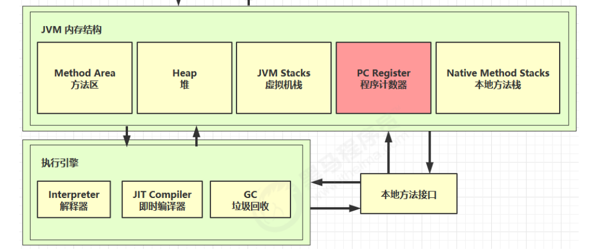

参考：https://www.cnblogs.com/newAndHui/p/11878504.html

### 一、定义

Program Counter Register 程序计数器（寄存器）（**线程独享**）：程序计数器是一块 较小 的**内存空间**，它可以看做是当前线程所执行的**字节码的 行号指示器** ；在虚拟机的概念模型里（仅仅是概念模型，各种虚拟机可能会通过一些更高效的方式去实现），字节码解释器工作时，就是通过**改变这个计数器的值来选取下一条需要执行的字节码指令**，分支、循环、跳准、异常处理、线程恢复等基础功能都需要依赖这个计数器来完成 ；

* 作用：记录正在执行的虚拟机字节码指令的地址（**如果正在执行的是本地方法则为空**）
* 特点：
  * 是线程私有的
  * 不会存在内存溢出
  * 生命周期随着线程，**线程启动而产生，线程结束而消亡**

### 二、特点详解

理解：程序计数器，可以看做是当前线程执行的**字节码的 行号指示器**

```java
//当java 文件被翻译为字节码的时候，字节码大概类似于下面的样子
public void test() {
    0 xxxx ..
    2 xxxx ..
    4 xxxx ..
    5 xxxx ..
}
```

上面左边的0、2、4、5，就是类似于字节码的**行号**（实际是**指令的偏移地址**），程序计数器中保存的值就是它们；字节码解释器，就是根据它们来执行程序的。

### 三、深入了解

java是支持多线程的，当CPU执行权从 A 线程，转移到 B 线程的时候，JVM就要暂时挂起线程 A ，去执行线程 B ；当线程 A 再次得到CPU执行权的时候，又会挂起B线程，继续执行 A 线程 ；

**1、CPU是怎么记住之前的A线程，执行到哪一处的：**

CPU根本就不会记住之前执行到哪里了，它只是埋头苦干；

**2、那是什么保证了切换线程的程序可以正常执行的：**

程序计数器 ；程序计数器里面保存的是 当前线程执行的字节码的行号（看着像行号，其实是指令地址）；

**3、那么，我们需要几个程序计数器呢：**（**每个线程都需要有一个独立的程序计数器**）

如果只有一个的话，切换B线程以后，程序计数器里面保存的就是B线程所执行的字节码的行号了，再切换回A线程，就蒙圈了，不知道执行到哪里了，因为，程序计数器里面保存的是B线程当前执行的字节码地址 ；因此，我们可以想象出，**要为每个线程都分配一个程序计数器**，**因此，程序计数器的内存空间是线程私有的** ；这样即使线程 A 被挂起，但是线程 A 里面的程序计数器，记住了A线程当前执行到的字节码的指令地址了 ，等**再次切回到A线程的时候，看一下程序计数器，就知道之前执行到哪里了**。

**4、那么程序计数器，什么时候分配内存呢：**

一个线程在执行的任何期间，都会失去CPU执行权，因此，我们要从一个线程被创建开始执行，就要无时无刻的记录着该线程当前执行到哪里了！因此，**线程计数器，必须是线程被创建开始执行的时候，就要一同被创建**

**5、程序计数器为什么不会存在内存溢出：**

程序技术器保存的是当前执行的**字节码的偏移地址**，当执行到下一条指令的时候，改变的只是程序计数器中保存的地址，并**不需要申请新的内存来保存新的指令地址**，因此，永远都不可能内存溢出；因此，jvm虚拟机规范，也就没有规定，也是唯一一个没有规定 OutOfMemoryError 异常 的区域（**即在同一块内存上更改字节码的偏移地址，不需要再创建新的内存来保存**）

**6、为什么当线程执行的是本地方法的时候，程序计数器中保存的值是空：**

因为**本地方法是 C++/C 写的，由系统调用，根本不会产生字节码文件**，因此，程序计数器也就不会做任何记录

