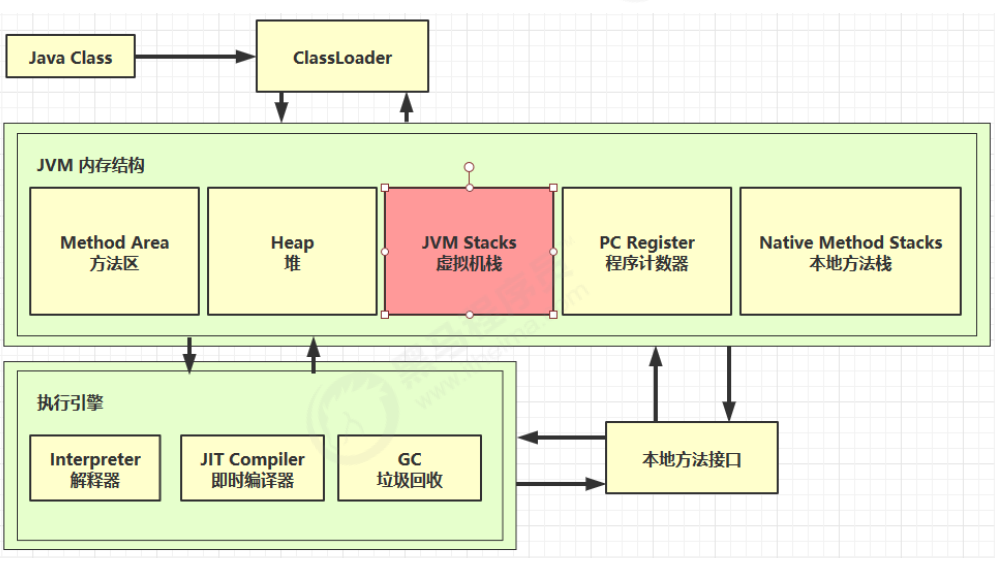
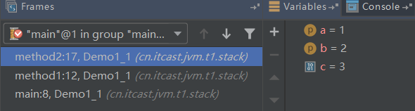
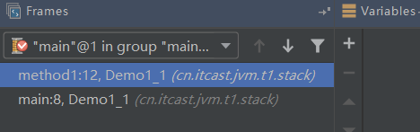

### 一、定义

Java Virtual Machine Stacks （Java 虚拟机栈）（**线程独享**）：

虚拟机栈描述的是Java 方法执行的内存模型：**每个方法在执行的同时都会创建一个栈帧**（StackFrame）用于存储**局部变量表、操作数栈、动态链接、方法出口**等信息。每一个方法从调用到执行完成的过程，就对应着一个栈帧在虚拟机栈中入栈到出栈的过程。

栈 - 线程运行时需要的内存空间

栈帧：包含参数、局部变量、返回地址

* 每个线程运行时所需要的内存，称为虚拟机栈
* 每个栈由多个栈帧（Frame）组成，对应着每次方法调用时所占用的内存
* 每个线程只能有一个**活动栈帧**，对应着当前**正在执行**的那个方法；**栈帧就是每个方法运行时需要的内存空间**
* 生命周期与线程相同

```java
/**
 * 演示栈帧
 */
public class Demo1_1 {
    public static void main(String[] args) throws InterruptedException {
        method1();
    }

    private static void method1() {
        method2(1, 2);
    }

    private static int method2(int a, int b) {
        int c =  a + b;
        return c;
    }
}
```

**debug：调用方法入栈**



**方法执行结束出栈：**



### 二、问题辨析

**1、垃圾回收是否涉及栈内存？**

不需要，因为方法调用完成后，栈帧会弹出栈，自动回收

**2、栈内存分配越大越好吗？**

不是，栈内存越大，可能会导致线程数越少，因为物理内存有限，栈内存越大，可以调用更多的方法，但会导致线程数越少

**3、方法内的局部变量是否线程安全？**

是线程安全的，局部变量是私有的，一个线程中创建的局部变量不会被另一个线程影响，即一个线程不能干扰另一个线程中的栈（除了static修饰的变量，因为 static变量 是线程共享的）

* 如果方法内局部变量**没有逃离方法的作用范围**（**所占用的内存是栈帧中的内存**），它是线程安全的
* 如果是局部变量引用了对象（**例如返回了该变量，可能被其他线程调用**），并**逃离方法的作用范围（栈）**，需要考虑线程安全

### 三、栈内存溢出

导致栈内存溢出的情况：

* 栈帧过多导致栈内存溢出（不停调用方法，没有出栈，**出现报错java.lang.StackOverflowError**）

```java
private static int count;

public static void main(String[] args) {
    try {
        method1();
    } catch (Throwable e) {
        e.printStackTrace();
        System.out.println(count);
    }
}

//方法递归调用导致栈溢出，无法出栈
private static void method1() {
    count++;
    method1();
}
```

* 栈帧过大导致栈内存溢出（不太容易出现这种情况）

### 四、线程运行误诊

定位

* 用 top 定位哪个进程对cpu的占用过高
* `ps H -eo pid,tid,%cpu | grep 进程id`（用ps命令进一步定位是哪个线程引起的cpu占用过高）
* `jstack  进程id`
  * 可以根据线程 id （转换成十六进制查看对应的线程）找到有问题的线程，进一步定位到问题代码的源码行号