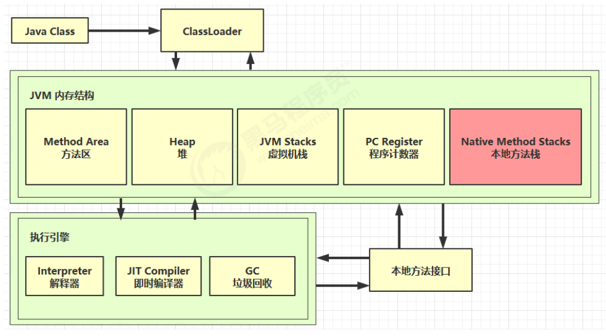

### 一、定义

**本地方法栈（线程私有）**与 java 虚拟机栈类似，它们之间的区别只是**虚拟机栈执行 Java 方法（也就是字节码）服务，而本地方法栈则是为虚拟机使用到的本地（Native）方法服务**。

**本地方法**一般是用其他语言（C、C++ 或 汇编语言等）编写的，并且被编译为基于本机硬件和操作系统的程序，对待这些方法需要特别处理。（比如Object中的 hashcode、wait、notify等都是本地方法）