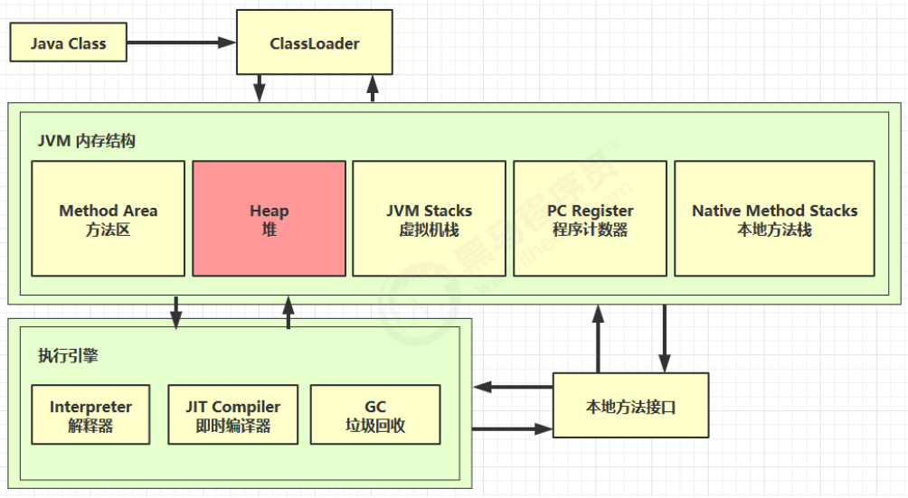

### 一、定义

Java 堆（Heap）（**线程共享**）

* 所有**线程共享**的一块内存区域，在虚拟机启动时创建。
* 此内存区域的唯一目的就是**存放对象实例**，“几乎”所有的**对象实例都在这里分配内存**（**用new创建的类变量才是实例**）

特点：

* 它是线程共享的，堆中对象都需要考虑线程安全的问题
* 有垃圾回收机制，是垃圾回收的主要区域（“**GC堆**”）（Garbage Collected Heap）
* 现代的垃圾收集器基本都是采用分代收集算法，其主要的思想是针对不同类型的对象采用不同的垃圾回收算法。可以将堆分成两块：
  * 新生代（Young Generation）
  * 老年代（Old Generation）
* 堆**不需要连续内存**，并且可以动态增加其内存，增加失败会抛出 OutOfMemoryError 异常（但对于大对象如数组对象，多数虚拟机实现出于实现简单、存储高效的考虑，很可能会要求连续的内存空间）

可以通过 -Xms 和 -Xmx 这两个虚拟机参数来指定一个程序的堆内存大小，第一个参数设置初始值，第二个参数设置最大值

`java -Xms1M -Xmx2M HackTheJava`

### 二、堆内存溢出

对象实例一直被使用，同时一直增加对堆内存的占用，导致堆内存无法释放，出现 OutOfMemoryError 异常

```java
/**
 * 演示堆内存溢出 java.lang.OutOfMemoryError: Java heap space
 * -Xmx8m
 */
public class Demo1_5 {

    public static void main(String[] args) {
        int i = 0;
        try {
            List<String> list = new ArrayList<>();
            String a = "hello";
            while (true) {
                list.add(a); // hello, hellohello, hellohellohellohello ...
                a = a + a;  // hellohellohellohello
                i++;
            }
        } catch (Throwable e) {
            e.printStackTrace();
            System.out.println(i);
        }
    }
}
```

报错信息：

```
24
java.lang.OutOfMemoryError: Java heap space
	at java.util.Arrays.copyOf(Arrays.java:3332)
	at java.lang.AbstractStringBuilder.ensureCapacityInternal(AbstractStringBuilder.java:124)
	at java.lang.AbstractStringBuilder.append(AbstractStringBuilder.java:448)
	at java.lang.StringBuilder.append(StringBuilder.java:136)
	at cn.itcast.jvm.t1.heap.Demo1_5.main(Demo1_5.java:19)
```

### 三、堆内存诊断

1. jps 工具
* 查看当前系统中有哪些 java 进程
2. jmap 工具
  * 查看堆内存占用情况 jmap - heap 进程id
3. jconsole 工具
  * 图形界面的，多功能的监测工具，可以连续监测
4. jvisualvm 工具
   * 图形界面，和 jconsole 类似，可以使用堆 Dump ，查看对象个数等信息

案例：

* 垃圾回收后，内存占用仍然很高

```java
/**
 * 演示查看对象个数 堆转储 dump
 */
public class Demo1_13 {

    public static void main(String[] args) throws InterruptedException {
        List<Student> students = new ArrayList<>();
        for (int i = 0; i < 200; i++) {
            students.add(new Student());
//            Student student = new Student();
        }
        Thread.sleep(1000000000L);
    }
}
class Student {
    private byte[] big = new byte[1024*1024];
}
```

