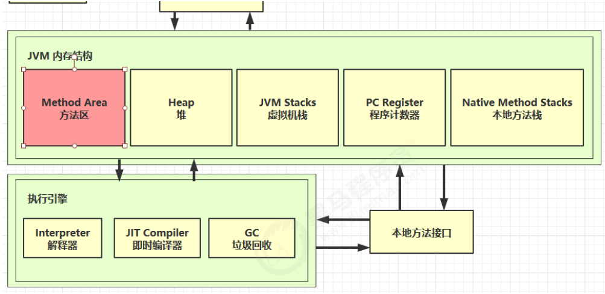
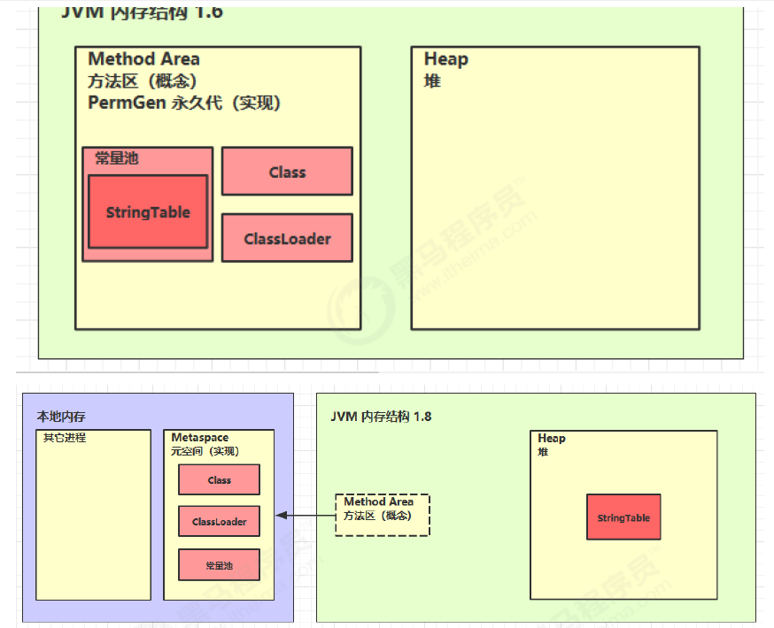
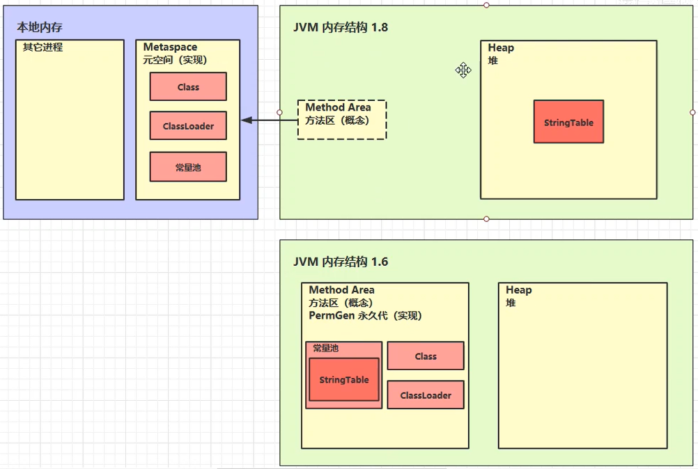

### 一、定义

**方法区**：与java堆一样，是各个**线程共享**的内存区域。用于存储已被**虚拟机加载的类型信息、常量、静态变量、即时编译器编译后的代码缓存等数据**。

和堆一样不需要连续的内存，并且可以动态扩展，动态扩展失败一样会抛出 OutOfMemoryError 异常

该区域的内存回收目标主要是**针对常量池的回收和对类型的卸载**，但是一般比较难实现（尤其是类型的卸载，条件相当苛刻）。

**方法区的演变过程：**

JDK8以前，HotSpot 虚拟机使用永久代来实现方法区，使得垃圾收集器能够像Java堆一样管理这部分内存。因为永久代有 -XX:MaxPermSize 的上限，这种设计导致 Java 应用更容易遇到内存溢出的问题（会抛出 OutOfMemoryError 异常）。

为了更容易管理方法区，在 JDK6 时，有了逐步改成**采用本地内存**来实现方法区的计划。到了 JDK7 ，已经把原本放在永久代的字符串常量池、静态变量等移出；**而到了 JDK8 ，完成废弃了永久代的概念，将原来永久代的数据分到了堆和元空间（使用系统内存，只要没到物理最大内存就没有上限，可以手动设置元空间最大内存如： -XX  MaxMetaspaceSize=8m）中，元空间存储类的元信息，静态变量和常量池等放入堆中。**

### 二、组成



### 三、方法区内存溢出

* JDK1.8 以前会导致永久代（**PermGen space**）内存溢出
* JDK1.8 之后会导致元空间（**Metaspace**）内存溢出

可能出现溢出的场景：

* spring
* mybatis

### 四、运行时常量池

* 常量池，就是一张表，虚拟机指令根据这张常量表找到要执行的类名、方法名、参数类型、字面量等信息
* 运行时常量池，**常量池是*.class 文件中的，当该类被加载，它的常量池信息就会放入运行时常量池**，并把里面的符号地址变为真实地址
* 运行时常量池时方法区的一部分
* 除了在编译期生成的常量，还允许动态生成，例如 String 类的 intern()

### 五、StringTable

**它的底层数据结构是HashTable**

主要存放字符串常量

面试题：

```java
// StringTable [ "a", "b" ,"ab" ]  hashtable 结构，不能扩容
public class Demo1_22 {
    // 常量池中的信息，都会被加载到运行时常量池中， 这时 a b ab 都是常量池中的符号，还没有变为 java 字符串对象
    // ldc #2 会把 a 符号变为 "a" 字符串对象
    // ldc #3 会把 b 符号变为 "b" 字符串对象
    // ldc #4 会把 ab 符号变为 "ab" 字符串对象

    public static void main(String[] args) {
        String s1 = "a"; // 懒惰的
        String s2 = "b";
        String s3 = "ab";   //先从常量池中查找，如果没有就创建
        String s4 = s1 + s2; // new StringBuilder().append("a").append("b").toString()  new String("ab")，在堆中创建了对象（s1、s2是变量）
        String s5 = "a" + "b";  // javac 在编译期间的优化，结果已经在编译期确定为ab（a、b是变量，可以直接从常量池中取出，常量字符串拼接）
        String s6 = s4.intern();

        // 问
        System.out.println(s3 == s4);   // false
        System.out.println(s3 == s5);   // true
        System.out.println(s3 == s6);   // true

        String x2 = new String("c") + new String("d");
        String x1 = "cd";
        x2.intern();

        // 问，如果调换了【最后两行代码】的位置呢，如果是jdk1.6呢
        System.out.println(x1 == x2);   // false；如果调换后，1.8的结果为true，1.6的结果为false，因为1.6中是复制出一个对象放入串池

    }
}
```

### 六、StringTable特性

* 常量池中的字符串仅是符号，第一次用到时才变为对象
* 利用串池的机制，来避免重复创建字符串对象
* 字符串变量拼接的原理是 StringBuilder（1.8）
* 字符串常量拼接的原理是编译器优化
* 可以使用 intern 方法，主动将串池中还没有的字符串对象放入串池
  * 1.8 将这个字符串对象尝试放入串池，如果有则并不会放入，如果没有则放入串池，会把串池中的对象返回
  * 1.6 将这个字符串对象尝试放入串池，如果有则并不会放入，如果没有会把此对象复制一份，放入串池，会把串池中的对象返回

### 七、StringTable位置



* jdk6：StringTable存储在**永久代**中
* jdk8：StringTable存储在**堆**中

```java
/**
 * 演示 StringTable 位置
 * 在jdk8下设置 -Xmx10m -XX:-UseGCOverheadLimit
 * 在jdk6下设置 -XX:MaxPermSize=10m
 */
public class Demo1_6 {

    public static void main(String[] args) throws InterruptedException {
        List<String> list = new ArrayList<String>();
        int i = 0;
        try {
            for (int j = 0; j < 260000; j++) {
                list.add(String.valueOf(j).intern());
                i++;
            }
        } catch (Throwable e) {
            e.printStackTrace();
        } finally {
            System.out.println(i);
        }
    }
}
```

### 八、StringTable垃圾回收（在堆中，会被垃圾回收）

测试代码

```java
/**
 * 演示 StringTable 垃圾回收
 * -Xmx10m -XX:+PrintStringTableStatistics -XX:+PrintGCDetails -verbose:gc
 * -Xmx10m(最大堆内存)
 * -XX:+PrintStringTableStatistics(打印字符串表的统计信息，查看字符串的实例个数，占用的大小信息)
 * -XX:+PrintGCDetails -verbose:gc(打印垃圾回收的详细信息，垃圾回收的次数，时间等)
 */
public class Demo1_7 {
    public static void main(String[] args) throws InterruptedException {
        int i = 0;
        try {
            for (int j = 0; j < 110000; j++) { // j=100, j=10000
                String.valueOf(j).intern();
                i++;
            }
        } catch (Throwable e) {
            e.printStackTrace();
        } finally {
            System.out.println(i);
        }

    }
}
```

运行结果：

```
[GC (Allocation Failure) [PSYoungGen: 2048K->488K(2560K)] 2048K->772K(9728K), 0.0008440 secs] [Times: user=0.00 sys=0.00, real=0.00 secs] 
[GC (Allocation Failure) [PSYoungGen: 2536K->488K(2560K)] 2820K->812K(9728K), 0.0008588 secs] [Times: user=0.00 sys=0.00, real=0.00 secs] 
[GC (Allocation Failure) [PSYoungGen: 2536K->488K(2560K)] 2860K->836K(9728K), 0.0014016 secs] [Times: user=0.05 sys=0.00, real=0.00 secs] 
110000
Heap
....
```

### 九、StringTable性能调优

* 调整 `-XX:StringTableSize=桶个数`
* 考虑将字符串对象是否入池（使用intern方法，多个相同值只存储一份）

```java
List<String> address = new ArrayList<>();
System.in.read();
for (int i = 0; i < 10; i++) {
    try (BufferedReader reader = new BufferedReader(new InputStreamReader(new FileInputStream("linux.words"), "utf-8"))) {
        String line = null;
        long start = System.nanoTime();
        while (true) {
            line = reader.readLine();
            if(line == null) {
                break;
            }
            address.add(line.intern()); //使用intern方法后，line未被引用会被垃圾回收，减少了字符串的个数，减少堆内存的占用
        }
        System.out.println("cost:" +(System.nanoTime()-start)/1000000);
    }
}
System.in.read();
```

