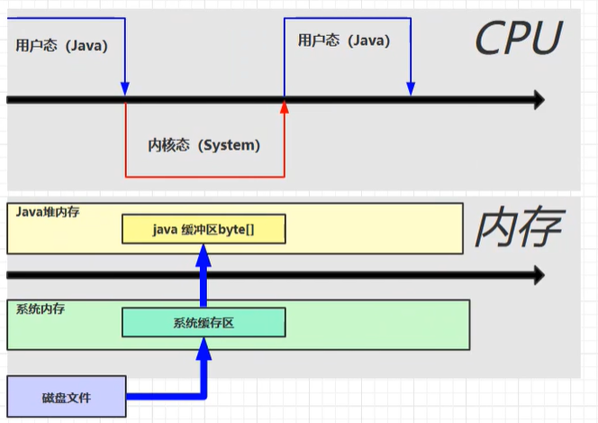
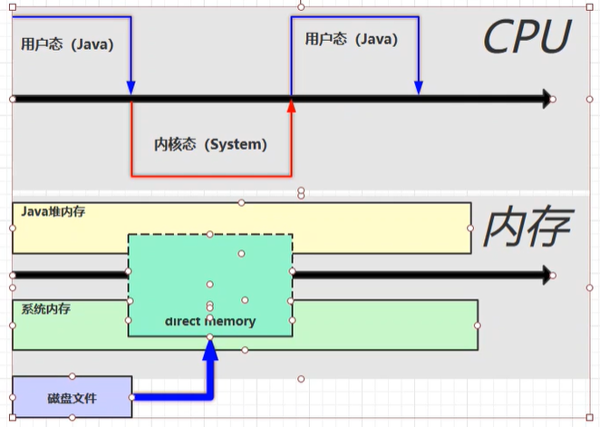

### 一、定义

**直接内存**（Direct Memory）并不是虚拟机运行时数据区的一部分，也不是《Java虚拟机规范》中定义的内存区域。但是这部分内存也被频繁地使用，而且也可能导致 OutOfMemoryError 异常出现。（即不属于JVM虚拟机内存区域，属于操作系统的内存）

在 JDK1.4 中新引入了NIO类，它可以使用 Native 函数库直接分配堆外内存，然后**通过 Java 堆里的 DirectByteBuffer 对象作为这块内存的引用进行操作**。这样就能在一些场景中显著提高性能，因为避免了在 Java 堆（堆内存）和 Native 堆（堆外内存）中来回复制数据。

* 常见于 NIO 操作时，用于数据缓冲区
* **分配回收成本较高**，但读写性能高
* 不受 JVM 内存回收管理

```java
ByteBuffer.allocateDirect();	//分配直接内存空间
```

```java
static final String FROM = "E:\\test.mp4";
static final String TO = "E:\\a.mp4";
static final int _1Mb = 1024 * 1024;

public static void main(String[] args) {
    io(); // io 用时：1535.586957 1766.963399 1359.240226
    directBuffer(); // directBuffer 用时：479.295165 702.291454 562.56592
}

private static void directBuffer() {
    long start = System.nanoTime();
    try (FileChannel from = new FileInputStream(FROM).getChannel();
         FileChannel to = new FileOutputStream(TO).getChannel();
        ) {
        ByteBuffer bb = ByteBuffer.allocateDirect(_1Mb);	//分配一块直接内存，系统和java程序都能访问
        while (true) {
            int len = from.read(bb);
            if (len == -1) {
                break;
            }
            bb.flip();
            to.write(bb);
            bb.clear();
        }
    } catch (IOException e) {
        e.printStackTrace();
    }
    long end = System.nanoTime();
    System.out.println("directBuffer 用时：" + (end - start) / 1000_000.0);
}

private static void io() {
    long start = System.nanoTime();
    try (FileInputStream from = new FileInputStream(FROM);
         FileOutputStream to = new FileOutputStream(TO);
        ) {
        byte[] buf = new byte[_1Mb];
        while (true) {
            int len = from.read(buf);
            if (len == -1) {
                break;
            }
            to.write(buf, 0, len);
        }
    } catch (IOException e) {
        e.printStackTrace();
    }
    long end = System.nanoTime();
    System.out.println("io 用时：" + (end - start) / 1000_000.0);
}
```

不使用直接内存进行读写：



使用直接内存进行读写：在操作系统划出一个缓冲区作为直接内存，系统和java程序都能访问，减少一个缓冲区的复制操作，加快文件的读写



### 二、分配和回收原理

* 使用了 Unsafe 对象完成直接内存的分配回收，并且回收需要主动调用 freeMemory 方法

```java
/**
 * 直接内存分配的底层原理：Unsafe
 */
public class Demo {
    static int _1Gb = 1024 * 1024 * 1024;

    public static void main(String[] args) throws IOException {
        Unsafe unsafe = getUnsafe();
        // 分配内存
        long base = unsafe.allocateMemory(_1Gb);
        unsafe.setMemory(base, _1Gb, (byte) 0);
        System.in.read();

        // 释放内存
        unsafe.freeMemory(base);
        System.in.read();
    }

    public static Unsafe getUnsafe() {
        try {
            Field f = Unsafe.class.getDeclaredField("theUnsafe");
            f.setAccessible(true);
            Unsafe unsafe = (Unsafe) f.get(null);
            return unsafe;
        } catch (NoSuchFieldException | IllegalAccessException e) {
            throw new RuntimeException(e);
        }
    }
}
```

* ByteBuffer 的实现类内部，使用了 Cleaner （虚引用）来监测 ByteBuffer 对象，一旦
  ByteBuffer 对象被垃圾回收，那么就会由 ReferenceHandler 线程通过 Cleaner 的 clean 方法调
  用 freeMemory 来释放直接内存

```java
/**
 * 禁用显式回收对直接内存的影响
 */
public class Demo1_26 {
    static int _1Gb = 1024 * 1024 * 1024;

    /*
     * -XX:+DisableExplicitGC 禁止显式的垃圾回收
     */
    public static void main(String[] args) throws IOException {
        ByteBuffer byteBuffer = ByteBuffer.allocateDirect(_1Gb);
        System.out.println("分配完毕...");
        System.in.read();
        System.out.println("开始释放...");
        byteBuffer = null;
        System.gc(); // 显式的垃圾回收，Full GC
        System.in.read();
    }
}
```

