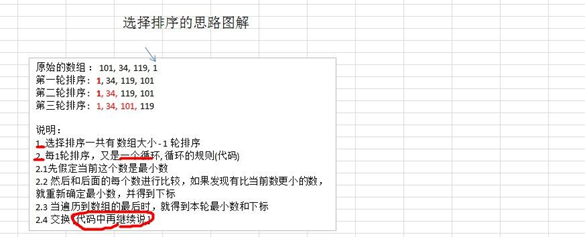

## 一、基本介绍

选择式排序也属于内部排序法，是从欲排序的数据中，按指定的规则选出某一元素，再依规定交换位置后达到排序的目的

**算法思想：**
选择排序（select sorting）也是一种简单的排序方法。它的基本思想是：第一次从 arr[0]~arr[n-1]中选取最小值， 与 arr[0]交换，第二次从 arr[1]~arr[n-1]中选取最小值，与 arr[1]交换，第三次从 arr[2]~arr[n-1]中选取最小值，与 arr[2] 交换，…，第 i 次从 arr[i-1]~arr[n-1]中选取最小值，与 arr[i-1]交换，…, 第 n-1 次从 arr[n-2]~arr[n-1]中选取最小值， 与 arr[n-2]交换，总共通过 n-1 次，得到一个按排序码从小到大排列的有序序列。

**个人理解：**每一次大循环过后，将该次循环中最小的值放在本次循环的起始下标

**图解：**



### 二、代码实现

```java
	// 选择排序
	public static void selectSort(int[] arr) {

		// 在推导过程中，发现规律，使用for循环解决
		// 选择排序的时间复杂度为O(n^2)
		for (int i = 0; i < arr.length; i++) {
			int minIndex = i; //最小下标
			int min = arr[i];	//最小值
			for (int j = i; j < arr.length; j++) {
				if (min > arr[j]) {
					minIndex = j;
					min = arr[j];
				}
			}
			// 将最小值放在arr[i]，作为交换
			if (minIndex != i) {
				arr[minIndex] = arr[i];
				arr[i] = min;
			}
		}
    }
```

