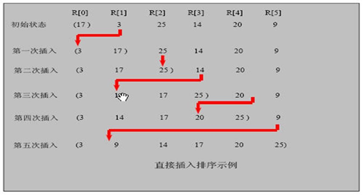

### 一、算法介绍

插入式排序属于内部排序法，是对于欲排序的元素以插入的方式找寻该元素的适当位置，以达到排序的目的。

**算法思想：**
插入排序（Insertion Sorting）的基本思想是：把 n 个待排序的元素看成为一个有序表和一个无序表，开始时有序表中只包含一个元素，无序表中包含有 n-1 个元素，排序过程中每次从无序表中取出第一个元素，把它的排序码依次与有序表元素的排序码进行比较，将它插入到有序表中的适当位置，使之成为新的有序表。

**个人思路：**将要插入的数逐个和前面的数进行比较，



### 二、代码实现

```java
	// 插入排序
	public static void insertSort(int[] arr) {

		int insertVal = 0;
		int insertIndex = 0;
		// 使用for循环实现算法
		for (int i = 1; i < arr.length; i++) {
			insertVal = arr[i]; // 待插入的数
			insertIndex = i - 1; // 待插入数的前一个数的下标

			while (insertIndex >= 0 && insertVal < arr[insertIndex]) {
				arr[insertIndex + 1] = arr[insertIndex];// 其实就是将大的数往后移动
				insertIndex--;
			}
			arr[insertIndex + 1] = insertVal;
//			System.out.printf("第%d轮插入结果：", i);
//			System.out.println(Arrays.toString(arr));
		}
    }
```

