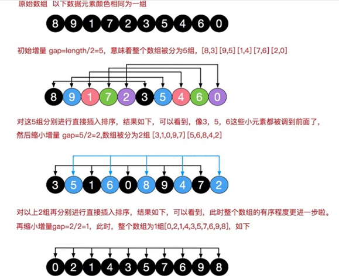
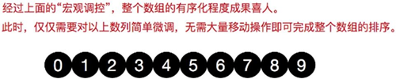

### 一、简单插入排序存在的问题

我们看简单的插入排序可能存在的问题.

数组 arr = {2,3,4,5,6,1} 这时需要插入的数 1**(****最小**), 这样的过程是：

{2,3,4,5,6,6}

{2,3,4,5,5,6}

{2,3,4,4,5,6}

{2,3,3,4,5,6}

{2,2,3,4,5,6}

{1,2,3,4,5,6}

**结论**: 当**需要插入的数是较小的数时**，**后移的次数明显增多**，对**效率**有影响.

### 二、算法介绍

希尔排序是希尔（Donald Shell）于 1959 年提出的一种排序算法。希尔排序也是一种**插入排序**，它是简单插入排序经过改进之后的一个**更高效的版本**，也称为**缩小增量排序**。

**算法思想：**希尔排序是把记录按下标的一定增量分组，对每组使用直接插入排序算法排序；随着增量逐渐减少，每组包含的关键词越来越多，当增量减至 1 时，整个文件恰被分成一组，算法便终止





### 三、代码实现

```java
	// 对交换式的希尔排序进行优化 -> 移位法
	public static void shellSort2(int[] arr) {

		// 增量gap，并逐步的缩小增量
		for (int gap = arr.length / 2; gap > 0; gap /= 2) {
			// 从第gap个元素，逐个对其所在的组进行直接插入排序
			for (int i = gap; i < arr.length; i++) {
				int j = i;
				int temp = arr[j]; // 待插入的元素
				if (arr[j] < arr[j - gap]) {
					while (j - gap >= 0 && temp < arr[j - gap]) {
						arr[j] = arr[j - gap];
						j -= gap;
					}
					// 当退出while后，就给temp找到插入的位置
					arr[j] = temp;
				}
			}
		}
//		System.out.println("排序后：" + Arrays.toString(arr));
	}

	// 使用逐步推导的方式来编写希尔排序
	public static void shellSort(int[] arr) {

		int temp = 0;
		int count = 0;
		for (int gap = arr.length / 2; gap > 0; gap /= 2) {
			for (int i = gap; i < arr.length; i += gap) {
				// 遍历各组中所有的元素(共gap组，每组有arr.length/gap个元素)，步长为gap
				for (int j = i - gap; j >= 0; j -= gap) {
					// 如果当前元素大于加上步长后的那个元素，说明交换
					if (arr[j] > arr[j + gap]) {
						// 交换法（慢）
						temp = arr[j];
						arr[j] = arr[j + gap];
						arr[j + gap] = temp;
					}
				}
			}
//			System.out.println("希尔排序第" + (++count) + "轮=" + Arrays.toString(arr));
		}
    }
```

