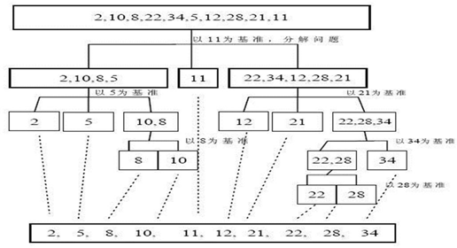

### 一、算法介绍

快速排序（Quicksort）是对**冒泡排序**的一种改进。基本思想是：通过一趟排序将要排序的数据分割成独立的两部分，其中一部分的所有数据都比另外一部分的所有数据都要小，然后再按此方法对这两部分数据分别进行快速排序，**整个排序过程可以递归进行**，以此达到整个数据变成有序序列



### 二、代码实现

要求: 对 [-9,78,0,23,-567,70] 进行从小到大的排序，要求使用快速排序法。【测试 8w 和 800w】

说明[验证分析]:

1)  如果取消左右递归，结果是 -9 -567 0 23 78 70

2)  如果取消右递归,结果是 -567 -9 0 23 78 70

3)  如果取消左递归,结果是 -9 -567 0 23 70 78

```java
	public static void quickSort(int[] arr, int left, int right) {
		int l = left; // 左下标
		int r = right; // 右下标
		// pivot 中轴
		int pivot = arr[(left + right) / 2];
		int temp = 0; // 临时变量，作为交换时使用
		// while循环的目的是让比pivot值小的放在右边，比pivot值大的放右边
		while (l < r) {
			// 在pivot的左边一直找，找到大于等于pivot值，才退出
			while (arr[l] < pivot) {
				l += 1;
			}
			// 在pivot的右边一直找，找到小于等于pivot的值
			while (arr[r] > pivot) {
				r -= 1;
			}
			// 如果l >= r说明pivot的左右两边的值，已经按照左边全部是小于等于pivot的值，右边全部是大于等于pivot的值
			if (l >= r) {
				break;
			}
			// 交换
			temp = arr[l];
			arr[l] = arr[r];
			arr[r] = temp;
			// 下面代码是为了防止某个数与中值相同死循环
			// 有可能左边走到基准值，而右边出现了和基准值相等的值
			// 此时需要进行指针位移打破这种循环
			// 如果交换完后，发现arr[l] == pivot值 ，r--，前移
			if (arr[l] == pivot) {
				r -= 1;
			}
			// 如果交换完后，发现arr[r] == pivot值 ，l++，后移
			if (arr[r] == pivot) {
				l += 1;
			}
		}

		// 如果l == r，必须l++，r--，否则会出现栈溢出
		if (l == r) {
			l += 1;
			r -= 1;
		}
		// 向左递归
		if (left < r) {
			quickSort(arr, left, r);
		}
		// 向右递归
		if (right > l) {
			quickSort(arr, l, right);
		}
	}
```

