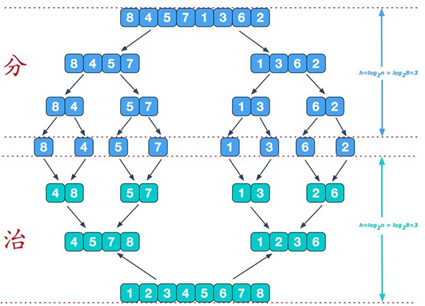
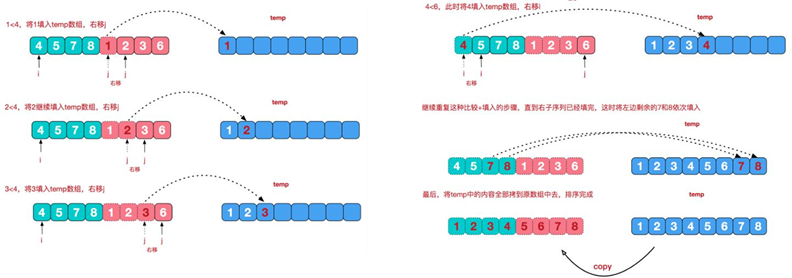

### 一、算法介绍

​		归并排序（MERGE-SORT）是利用归并的思想实现的排序方法，该算法采用经典的**分治****（****divide-and-conquer****） 策略**（分治法将问题分(divide)成一些**小的问题然后递归求解**，而治(conquer)的阶段则将分的阶段得到的各答案"修补"在一起，即分而治之)。

### 二、算法思想

**分治：**



**合并相邻有序子序列:**

​		在**治阶段**，我们需要将两个已经有序的子序列合并成一个有序序列，比如上图中的最后一次合并，要将[4,5,7,8]和[1,2,3,6]两个已经有序的子序列，合并为最终序列[1,2,3,4,5,6,7,8]，来看下实现步骤：



### 三、代码实现：

```java
	// 分 + 合方法
	public static void mergeSort(int[] arr, int left, int right, int[] temp) {
		if (left < right) {
			int mid = (left + right) / 2; // 中间索引
			// 向左递归进行分解
			mergeSort(arr, left, mid, temp);
			// 向右递归进行分解
			mergeSort(arr, mid + 1, right, temp);
			// 到合并
			merge(arr, left, mid, right, temp);
		}
	}

	// 合并的方法
	/**
	 * 
	 * @param arr   排序的原始数组
	 * @param left  左边有序序列的初始索引
	 * @param mid   中间索引
	 * @param right 右边
	 * @param temp  做中转数组
	 */
	public static void merge(int[] arr, int left, int mid, int right, int[] temp) {
//		System.out.println("合并");
		int i = left; // 初始化i，左边有序序列的初始索引
		int j = mid + 1; // 初始化j，右边有序序列的初始索引
		int t = 0; // 指向temp数组的当前索引

		// （一）
		// 先把左右两边（有序）的数据按照规则填充到temp数组
		// 直到左右两边的有序序列，有一边处理完毕为止
		while (i <= mid && j <= right) {
			// 继续
			// 如果左边的有序序列的当前元素，小于等于右边有序序列的当前元素，即将左边的当前元素，拷贝到temp数组
			// t、i往后移
			if (arr[i] <= arr[j]) {
				temp[t] = arr[i];
				t += 1;
				i += 1;
			} else {
				// 反之，将右边有序序列的当前元素，填充到temp数组
				temp[t] = arr[j];
				t += 1;
				j += 1;
			}

		}

		// （二）
		// 把有剩余数据的一边的数据依次全部填充到temp
		while (i <= mid) {
			// 左边的有序序列还有剩余的元素，就全部填充到temp
			temp[t] = arr[i];
			t += 1;
			i += 1;
		}

		while (j <= right) {
			// 右边的有序序列还有剩余的元素，就全部填充到temp
			temp[t] = arr[j];
			t += 1;
			j += 1;
		}

		// （三）
		// 将temp数组的元素拷贝到arr
		// 注意，并不是每次都拷贝所有
		t = 0;
		int tempLeft = left;
//		System.out.println("tempLeft=" + tempLeft + "right=" + right);
		while (tempLeft <= right) {
			// 第一次合并 tempLeft = 0，right = 1 // tempLeft = 2，right = 3 // tempLeft = 0，right
			// = 3。。。。
			// 最后一次 tempLeft = 0，right = 7（共有7(arr.length - 1)次合并）
			arr[tempLeft] = temp[t];
			t += 1;
			tempLeft += 1;
		}
	}
```

