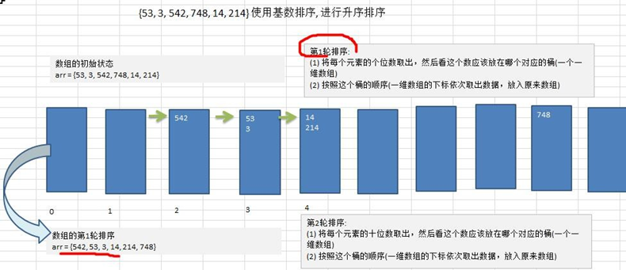

### 一、算法介绍

1)  基数排序（radix sort）属于“分配式排序”（distribution sort），又称“桶子法”（bucket sort）或 bin sort，顾名思义，它是通过键值的各个位的值，将要排序的元素分配至某些“桶”中，达到排序的作用

2)  基数排序法是属于稳定性的排序，基数排序法的是效率高的**稳定性**排序法

3)  基数排序(Radix Sort)是桶排序的扩展

4)  基数排序是 1887 年赫尔曼·何乐礼发明的。它是这样实现的：将整数按位数切割成不同的数字，然后按每个位数分别比较。

### 二、算法思想

1)  将所有待比较数值统一为同样的数位长度，数位较短的数前面补零。然后，从最低位开始，依次进行一次排序。这样从最低位排序一直到最高位排序完成以后, 数列就变成一个有序序列。

2）图解：将数组 {53, 3, 542, 748, 14, 214} 使用基数排序, 进行升序排序




### 三、基数排序的说明

1)   基数排序是对传统桶排序的扩展，速度很快.

2)   基数排序是经典的空间换时间的方式，占用内存很大, 当对海量数据排序时，容易造成 OutOfMemoryError 。

3)   基数排序时稳定的。[注:假定在待排序的记录序列中，存在多个具有相同的关键字的记录，若经过排序，这些记录的相对次序保持不变，即在原序列中，r[i]=r[j]，且 r[i]在 r[j]之前，而在排序后的序列中，r[i]仍在 r[j]之前， 则称这种排序算法是稳定的；否则称为不稳定的]

4)   有负数的数组，我们不用基数排序来进行排序, 如果要支持负数，参考: https://code.i-harness.com/zh-CN/q/e98fa9

### 四、代码实现

```java
	// 基数排序方法
	public static void radixSort(int[] arr) {

		// 根据下面的推导过程，我们可以得到最终的基数排序代码
		int[][] bucket = new int[10][arr.length];
		int[] bucketElementCounts = new int[10];

		// 1.得到数组中最大的数的位数
		int max = 0;
		for (int i = 0; i < arr.length; i++) {
			if (arr[i] > max) {
				max = arr[i];
			}
		}
		// 得到最大数是几位数
		int maxLength = (max + "").length();
		// 这里使用循环将代码处理
		for (int i = 0; i < maxLength; i++) {
			for (int j = 0; j < arr.length; j++) {
				int digitOfElement = arr[j] / (int)Math.pow(10, i) % 10;
				bucket[digitOfElement][bucketElementCounts[digitOfElement]] = arr[j];
				bucketElementCounts[digitOfElement]++;
			}
			int index = 0;
			for (int k = 0; k < bucketElementCounts.length; k++) {
				for(int l = 0; l < bucketElementCounts[k]; l++) {					
					if (bucketElementCounts[k] != 0) {
						arr[index++] = bucket[k][l]; 
					}
				}
				bucketElementCounts[k] = 0;
			}
		}
//		System.out.println("排序处理后arr=" + Arrays.toString(arr));
        
         // 算法逐步分解
		// 定义一个二维数组，表示10个桶，每个桶就是一个一维数组
		// 说明
		// 1.二维数组包含10个一维数组
		// 2.为了防止在放入数的时候，数据溢出，则每个一维数组（桶），大小定为arr.length
		// 3.基数排序是使用空间换时间的经典算法
		int[][] bucket = new int[10][arr.length];

		// 为了记录每个桶中，实际存放了多少个数据，我们定义一个一维数组来记录各个桶每次放入数据的个数
		// bucketElementCounts[0]，记录的就是 bucket[0] 桶的放入数据个数
		int[] bucketElementCounts = new int[10];

		// 第1轮排序（针对每个元素的个位进行排序处理）
		for (int j = 0; j < arr.length; j++) {
			// 取出每个元素的个位的值
			int digitOfElement = arr[j] % 10;
			// 放到对应的桶中
			bucket[digitOfElement][bucketElementCounts[digitOfElement]] = arr[j];
			bucketElementCounts[digitOfElement]++;
		}

		// 按照这个桶的顺序(一维数组的下标依次取出数据，放入原来数组)
		int index = 0;
		// 遍历每个桶，并将桶中的数据，放入原数组
		for (int k = 0; k < bucketElementCounts.length; k++) {
			// 如果桶中有数据，我们才放入到数组
			if (bucketElementCounts[k] != 0) {
				// 循环该桶即第k个桶（即第k个一维数组），放入
				for (int l = 0; l < bucketElementCounts[k]; l++) {
					arr[index++] = bucket[k][l];

				}
			}
			//第一轮处理后，需要将每个bucketElementCounts[k] = 0
			bucketElementCounts[k] = 0;
		}

		System.out.println("第1轮，对个位的排序处理arr=" + Arrays.toString(arr));
		
		//==========================
		// 第2轮排序（针对每个元素的个位进行排序处理）
		for (int j = 0; j < arr.length; j++) {
			// 取出每个元素的个位的值
			int digitOfElement = arr[j] / 10 % 10;
			// 放到对应的桶中
			bucket[digitOfElement][bucketElementCounts[digitOfElement]] = arr[j];
			bucketElementCounts[digitOfElement]++;
		}

		// 按照这个桶的顺序(一维数组的下标依次取出数据，放入原来数组)
		index = 0;
		// 遍历每个桶，并将桶中的数据，放入原数组
		for (int k = 0; k < bucketElementCounts.length; k++) {
			// 如果桶中有数据，我们才放入到数组
			if (bucketElementCounts[k] != 0) {
				// 循环该桶即第k个桶（即第k个一维数组），放入
				for (int l = 0; l < bucketElementCounts[k]; l++) {
					arr[index++] = bucket[k][l];
				}
			}
			bucketElementCounts[k] = 0;
		}

		System.out.println("第2轮，对十位的排序处理arr=" + Arrays.toString(arr));
		
		//==========================
		// 第3轮排序（针对每个元素的个位进行排序处理）
		for (int j = 0; j < arr.length; j++) {
			// 取出每个元素的个位的值
			int digitOfElement = arr[j] / 100 % 10;
			// 放到对应的桶中
			bucket[digitOfElement][bucketElementCounts[digitOfElement]] = arr[j];
			bucketElementCounts[digitOfElement]++;
		}

		// 按照这个桶的顺序(一维数组的下标依次取出数据，放入原来数组)
		index = 0;
		// 遍历每个桶，并将桶中的数据，放入原数组
		for (int k = 0; k < bucketElementCounts.length; k++) {
			// 如果桶中有数据，我们才放入到数组
			if (bucketElementCounts[k] != 0) {
				// 循环该桶即第k个桶（即第k个一维数组），放入
				for (int l = 0; l < bucketElementCounts[k]; l++) {
					arr[index++] = bucket[k][l];
				}
			}
			bucketElementCounts[k] = 0;
		}

		System.out.println("第3轮，对百位的排序处理arr=" + Arrays.toString(arr));

	}
```

