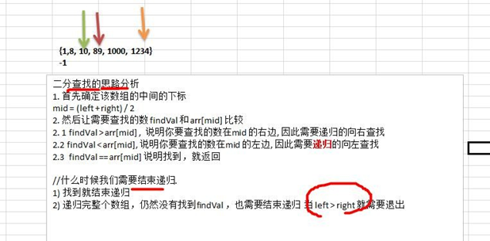

### 一、查找算法介绍

在 java 中，我们常用的查找有四种:

1)  顺序(线性)查找

2)  二分查找/折半查找

3)  插值查找

4)  斐波那契查找

### 二、线性查找算法

思路： 线性查找是逐一比对，发现有相同值，就返回下标

**代码实现：**

```java
	public static void main(String[] args) {
		// TODO Auto-generated method stub
		int[] arr = { 1, 9, 11, -1, 34, 89 };	//没有顺序的数组
		int index = seqSearch(arr,11);
		if (index == -1) {
			System.out.println("没有找到");
		} else {
			System.out.println("找到，下标为 = " + index);
		}
	}

	/**
	 * 这里实现的线性查找是找到一个满足条件的值，就返回
	 * 
	 * @param arr
	 * @param value
	 * @return
	 */
	public static int seqSearch(int[] arr, int value) {
		// 线性查找是逐一比对，发现有相同值，就返回下标
		for (int i = 0; i < arr.length; i++) {
			if (arr[i] == value) {
				return i;
			}
		}
		return -1;
	}
```

### 三、二分查找

**算法思路图解：**



**代码实现：**

```java
	// 二分查找算法
	/**
	 * 
	 * @param arr     数组
	 * @param left    左边的索引
	 * @param right   右边的索引
	 * @param findVal 要查找的值
	 * @return 如果找到就返回下标，如果没有找到，就返回-1
	 */
	public static int binarySearch(int[] arr, int left, int right, int findVal) {

		// 当left > right时， 说明递归整个数组，但是没有找到
		if (left > right) {
			return -1;
		}
		int mid = (left + right) / 2;
		int midVal = arr[mid];

		if (findVal > midVal) {
			// 向右递归
			return binarySearch(arr, mid + 1, right, findVal);
		} else if (findVal < midVal) {
			// 向左递归
			return binarySearch(arr, left, mid - 1, findVal);
		} else {
			return mid;
		}
	}

	/**
	 * 
	 * 思考题：{ 1, 8, 10, 89, 1000, 1234 } 当一个有序数组中，有多个相同的数值时，如何将所有的数值都查找到，比如有多个1000
	 * 
	 * 思路分析： 1. 在找到mid索引值，不要马上返回 2. 向mid 索引值的左边扫描，将所有满足 1000 的元素的下标，加入到集合ArrayList
	 * 3. 向mid 索引值的右边扫描，将所有满足 1000 的元素的下标，加入到集合ArrayList 4. 将ArrayList返回
	 */
	public static List<Integer> binarySearch2(int[] arr, int left, int right, int findVal) {

		// 当left > right时， 说明递归整个数组，但是没有找到
		if (left > right) {
			return new ArrayList<Integer>();
		}
		int mid = (left + right) / 2;
		int midVal = arr[mid];

		if (findVal > midVal) {
			// 向右递归
			return binarySearch2(arr, mid + 1, right, findVal);
		} else if (findVal < midVal) {
			// 向左递归
			return binarySearch2(arr, left, mid - 1, findVal);
		} else {
			/*
			 * 思路分析： 1. 在找到mid索引值，不要马上返回 2. 向mid 索引值的左边扫描，将所有满足 1000 的元素的下标，加入到集合ArrayList
			 * 3. 向mid 索引值的右边扫描，将所有满足 1000 的元素的下标，加入到集合ArrayList 4. 将ArrayList返回
			 */
			List<Integer> resIndexlist = new ArrayList<Integer>();
			// 向mid 索引值的左边扫描，将所有满足 1000 的元素的下标，加入到集合ArrayList中
			int temp = mid - 1;
			while (true) {
				if (temp < 0 || arr[temp] != findVal) {
					break;
				}
				resIndexlist.add(temp);
				temp--;
			}
			resIndexlist.add(mid);

			// 向mid 索引值的右边扫描，将所有满足 1000 的元素的下标，加入到集合ArrayList中
			temp = mid + 1;
			while (true) {
				if (temp > arr.length - 1 || arr[temp] != findVal) {
					break;
				}
				resIndexlist.add(temp);
				temp++;
			}

			return resIndexlist;
		}
	}
```

