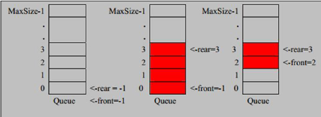
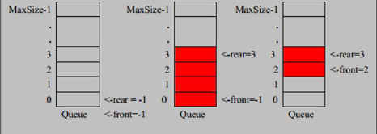

## 队列：数组模拟队列

### 一、队列介绍

1）队列是一个有序列表，可以用数组或是链表来实现

2）遵循先入先出的原则。即：先存入队列的数据，要先取出，后存入的要后取出

3）示意图：（使用数组模拟队列示意图）



### 二、数组模拟队列思路

1）队列本身是有序列表，若使用数组的结构来存储队列的数据，则队列数组的声明如下图，其中maxSize是该队列的最大容量。

2）因为队列的输出、输入是分别从前后端来处理，因此需要两个变量front及rear分别记录队列前后端的下标，front会随着数据输出而改变，而rear则是随着数据输入而改变，如下图：


3）当我们将数据存入队列时称为“addQueue”，addQueue的处理需要两个步骤，思路分析

​		1）将尾指针往后移：rear + 1，当front == rear，则队列为空

​		2）若尾指针rear小于队列的最大小标maxSize-1，则将数据存入rear所指的数组元素中，否则无法存入数据，若rear ==maxSize -1，队列满

### 三、代码实现

```
public class ArrayQueueDemo {
	
	public static void main(String[] args) {
		//测试
		//创建一个队列
		ArrayQueue arrayQueue = new ArrayQueue(3);
		char key = ' ';	//接收用户输入
		Scanner scanner = new Scanner(System.in);	//从键盘接收数据
		boolean loop = true;
		//输出一个菜单
		while(loop) {
			System.out.println("s(show)：显示队列");
			System.out.println("e(exit)：退出程序");
			System.out.println("a(add)：添加数据到队列");
			System.out.println("g(get)：从队列取出数据");
			System.out.println("h(head)：查看队列头的数据");
			key = scanner.next().charAt(0);	 // 接收一个字符
			switch(key) {
			case 's':	//显示队列
				arrayQueue.showQueue();
				break;
			case 'a':	//添加数据
				System.out.println("输出一个数");
				int value = scanner.nextInt();
				arrayQueue.addQueue(value);
				break;
			case 'g':	//取出数据
				try {
					int res = arrayQueue.getQueue();
					System.out.printf("取出的数据是%d\n",res);
				} catch (Exception e) {
					// TODO: handle exception
					System.out.println(e.getMessage());
				}
				break;
			case 'h':	//查看队列头的数据
				try {
					int res = arrayQueue.headQueue();
					System.out.printf("队列头的数据是%d\n",res);
				} catch (Exception e) {
					// TODO: handle exception
					System.out.println(e.getMessage());
				}
				break;	
			case 'e':	//退出
				scanner.close();
				loop = false;
				break;
			default:	
				break;
			}
		}
		System.out.println("程序退出");
	}
}

//使用数组模拟列表-编写一个ArrayQueue类
class ArrayQueue {
	private int maxSize;	//表示数组的最大容量
	private int front;	//队列头
	private int rear; //队列尾
	private int[] arr; //该数据用于存放数据，模拟队列
	
	//创建队列的构造器
	public ArrayQueue(int arrMaxSize) {
		super();
		this.maxSize = arrMaxSize;
		arr = new int[maxSize];
		front = -1;		//指向队列头部,分析出front是指向队列头的前一个位置
		rear = -1;		//指向队列尾，指向队列尾的数据（即队列最后一个数据）
	}
	
	//判断队列是否满
	public boolean isFull() {
		return rear == maxSize -1;
	}
	
	//判断队列是否为空
	public boolean isEmpty() {
		return rear == front;
	}
	
	//添加数据到队列
	public void addQueue(int n) {
		//判断队列是否满
		if(isFull()) {
			System.out.println("队列满，不能加入输~");
			return;
		}
		rear++;	//让rear后移
		arr[rear] = n;
	}
	
	//获取队列的数据，出队列
	public int getQueue() {
		//判断队列是否为空
		if(isEmpty()) {
			//通过抛出异常
			throw new RuntimeException("队列为空，不能取数据");
		}
		front++;	//front后移
		return  arr[front];
	}
	
	//显示队列的所有数据
	public void showQueue() {
		//遍历
		if(isEmpty()) {
			System.out.println("队列为空，没有数据 ~");
			return;
		}
		for(int i = 0; i < arr.length; i++) {
			System.out.printf("arr[%d]=%d\n",i,arr[i]);
		}
	}
	
	//显示队列的头数据，注意不是取出数据
	public int headQueue() {
		//判断
		if(isEmpty()) {
			throw new RuntimeException("队列为空，没有数据~");
		}
		return arr[front + 1];
	}
}
```

