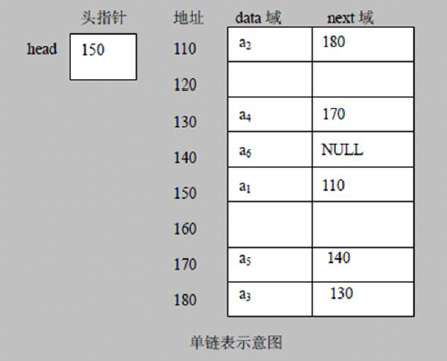
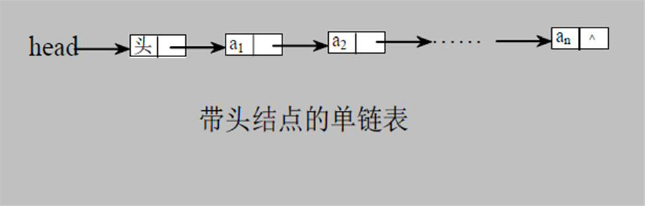

## 链表：单链表

### 一、链表介绍

链表是有序的列表，但是它在内存中是存储如下：



小结如上图：

1）链表是以节点的方式来存储，是链式存储 

2）每个节点包含**data**域，**next**域：指向下一个节点

3）如图：发现**链表的各个节点不一定是连续存储（即地址不是连续的）**

4）链表分带头节点的链表和没有头节点的链表，根据实际的需求来确定

* 单链表（带头节点）逻辑结构示意图如下：



### 二、单链表的应用实例

使用带head头的单向链表实现 —— 水浒英雄排行榜管理完成对英雄人物的增删改查操作（删除、修改、查找）

#### 1）第一种方法在添加英雄时，直接添加到链表的尾部

**添加：**

* 先创建一个head头节点，作用就是表示单链表的头
* 后面我们每添加一个节点，就直接加入到链表的最后

**遍历：**

* 通过一个辅助变量遍历，帮助遍历整个链表

#### 2）第二种方式在添加英雄时，根据排名将英雄插入到指定位置（如果有这个排名，则添加失败，并给出提示）

**需要按照编号的顺序添加：**

* 首先找到新添加的节点的位置，是通过辅助变量（指针），通过遍历来搞定
* `新的节点.next = temp.next`
* 将`temp.next` = 新的节点

#### 3）修改节点功能

**思路：**

1）先找到该节点，通过遍历

2）

```
temp.name = newHeroNode.name;
temp.nickname = newHeroNode.nickname;
```

#### 4）删除节点

**思路：**

* 先找到需要删除的这个节点的前一个节点temp
* `temp.next = temp.next.next`
* 被删除的节点，将不会有其他引用指引，会被垃圾回收机制回收

### 三、代码演示

```java
public class SingleLinkedListDemo {

	public static void main(String[] args) {
		//测试
		//先创建节点
		HeroNode hero1 = new HeroNode(1,"宋江","及时雨");
		HeroNode hero2 = new HeroNode(2,"卢俊义","玉麒麟");
		HeroNode hero3 = new HeroNode(3,"吴用","智多星");
		HeroNode hero4 = new HeroNode(4,"林冲","豹子头");
		
		//创建一个链表
		SingleLinkedList singleLinkedList = new SingleLinkedList();
		//加入,直接在链表尾部添加
//		singleLinkedList.add(hero1);
//		singleLinkedList.add(hero2);
//		singleLinkedList.add(hero3);
//		singleLinkedList.add(hero4);
		
		//加入按照编号的顺序
		singleLinkedList.addByOrder(hero1);
		singleLinkedList.addByOrder(hero4);
		singleLinkedList.addByOrder(hero2);
		singleLinkedList.addByOrder(hero3);
		
		//显示链表
		System.out.println("打印链表----");
		singleLinkedList.list();
		
		//显示链表
		System.out.println("打印链表----");
		singleLinkedList2.list();
		
		//测试修改节点的代码
		HeroNode newHeroNode = new HeroNode(2,"小卢","玉麒麟~~");
		singleLinkedList.update(newHeroNode);
		
		System.out.println("修改后的链表---------");
		
		//显示链表
		singleLinkedList.list();
		
		//删除节点
		singleLinkedList.del(1);
		singleLinkedList.del(4);
		System.out.println("删除后的链表情况");
		singleLinkedList.list();
		
	}
	
	//方法：获取到单链表的节点的个数（如果是带头节点的链表，需求不统计头）
	/**
	 * 
	 * @param head	链表的头节点
	 * @return	返回的是有效节点的个数
	 */
	public static int getLength(HeroNode head) {
		if(head.next == null) {
			//空链表
			return 0; 
		}
		int length = 0;
		//定义一个辅助的变量，这里没有统计头节点
		HeroNode cur = head.next;
		while(cur != null) {
			length++;
			cur = cur.next;	//遍历
		}
		return length;
	}
}

//定义SingleLinkedList 来管理我们的英雄
class SingleLinkedList {
	//先初始化一个头节点，头节点不要动
	private HeroNode head = new HeroNode(0,"","");

	//返回头节点
	public HeroNode getHead() {
		return head;
	}

	//添加节点到单向链表
	//思路：当不考虑编号顺序时
	//1.找到当前链表的最后节点
	//2.将最后这个节点的next指向新的节点
	public void add(HeroNode heroNode) {
		
		//因为head节点不能动，因此我们需要一个辅助遍历节点temp
		HeroNode temp = head;
		//遍历链表，找到最后
		while(true) {
			//找到链表的最后
			if(temp.next == null) {
				break;
			}
			//如果没有找到最后，则将temp后移
			temp = temp.next;
		}
		//当退出while循环时，temp就指向了链表的最后
		//将最后这个节点的next 指向新的节点
		temp.next = heroNode;
	}
	
	//第二钟方式在添加英雄时，根据排名将英雄插入到指定位置
	//如果有这个排名，则添加失败，并给出提示
	public void addByOrder(HeroNode heroNode) {
		//因为头节点不能动，因此我们仍然通过一个辅助指针（变量）来帮助找到添加的位置
		//因为单链表，所以我们找的temp是位于添加位置的前一个节点，否则插入不了
		HeroNode temp = head;
		boolean flag = false; 	//flag标志添加的编号是否存在，默认为false
		while(true) {
			if(temp.next == null) {
				//说明temp已经在链表的最后
				break;
			}
			if(temp.next.no > heroNode.no) {	//位置找到，就在temp的后面插入
				break;
			}else if(temp.next.no == heroNode.no) {
				//说明希望添加的heroNode的编号已然存在
				flag = true;	//说明编号存在
				break;
			}
			temp = temp.next;	//后移，遍历当前链表
		}
		//判断flag的值
		if(flag) {
			//flag为true，不能添加，说明编号存在
			System.out.printf("准备插入的英雄的编号%d已经存在，不能加入\n",heroNode.no);
		}else {
			//插入到链表中，temp的后面
			heroNode.next = temp.next;
			temp.next = heroNode;
		}
	}
	
	//修改节点的信息，根据no编号来修改，即no编号不能改
	//说明
	//1.根据new HeroNode 的 no 来修改即可
	public void update(HeroNode newHeroNode) {
		//判断是否为空
		if(head.next == null) {
			System.out.println("链表为空");
		}
		//找到需要修改的节点，根据 no编号
		//先定义一个辅助变量
		HeroNode temp = head.next;
		boolean flag = false;		//用于表示是否找到该节点
		while(true) {
			if(temp == null) {
				break;	//已经遍历完链表
			}
			if(temp.no == newHeroNode.no) {
				//找到节点
				flag = true;
				break;
			}
			temp = temp.next;
		}
		//根据flag判断是否找到要修改的节点
		if(flag) {
			temp.name = newHeroNode.name;
			temp.nickname = newHeroNode.nickname;
		} else {
			//没有找到
			System.out.printf("没有找到编号%d的节点，不能修改\n",newHeroNode.no);
		}
	}
	
	//删除节点
	//思路
	//1.head不能动，因此我们需要一个temp辅助节点找到待删除节点的前一个节点
	//2.说明我们在比较时，是temp.next.no 和 需要删除的节点的no比较
	public void del(int no) {
		HeroNode temp = head;
		boolean flag = false;	// 标志是否找到待删除的节点
		while(true) {
			if(temp.next == null) {
				//已经到链表的最后
				break;
			}
			if(temp.next.no == no) {
				//找到的待删除节点的前一个节点temp
				flag = true;
				break;
			}
			temp = temp.next;
		}
		//判断flag
		if(flag) {
			//找到，可以删除
			temp.next = temp.next.next;
		}else {
			System.out.printf("要删除的%d节点不存在\n",no);
		}
	}
	
	//显示链表(遍历)
	public void list() {
		//判断链表是否为空
		if(head.next == null) {
			System.out.println("链表为空");
			return;
		}
		//因为头节点不能动，因此我们需要一个辅助变量来遍历
		HeroNode temp = head.next;
		while(true) {
			//判断是否到链表最后
			if(temp == null) {
				break;
			}
			//输出节点的信息
			System.out.println(temp);
			//将temp后移
			temp = temp.next;
		}
	}
}

//定义一个HeroNode，每个HeroNode，对象就是一个节点
class HeroNode {
	public int no;
	public String name;
	public String nickname;
	public HeroNode next;	//指向下一个节点
	
	//构造器
	public HeroNode(int no, String name, String nickname) {
		this.no = no;
		this.name = name;
		this.nickname = nickname;
	}
	
	//为了显示方法，我们重写toString	
	@Override
	public String toString() {
		return "HeroNode [no=" + no + ", name=" + name + ", nickname=" + nickname + "]";
	}

}
```

### 四、单链表面试题

单链表的常见面试题有如下：

#### 1）求单链表中有效节点的个数

```java
	//方法：获取到单链表的节点的个数（如果是带头节点的链表，需求不统计头）
	/**
	 * 
	 * @param head	链表的头节点
	 * @return	返回的是有效节点的个数
	 */
	public static int getLength(HeroNode head) {
		if(head.next == null) {
			//空链表
			return 0; 
		}
		int length = 0;
		//定义一个辅助的变量，这里没有统计头节点
		HeroNode cur = head.next;
		while(cur != null) {
			length++;
			cur = cur.next;	//遍历
		}
		return length;
	}
```

#### 2）查找单链表中的倒数第k个节点【新浪面试题】

```java
	//查找单链表中的倒数第k个节点[新浪面试]
	//思路
	//1、编写一个方法，接收head节点，同时接收一个index
	//2、index表示倒数第index个节点
	//3、先把链表从头到尾遍历，得到链表的总的长度getLength
	//4、得到size后，我们从链表的第一个开始遍历（size-index）个，就可以得到
	//5、如果找到了，则返回该节点，否则返回null
	public static HeroNode findLastIndexNode(HeroNode head, int index) {
		//判断如果链表为空，返回null
		if(head.next == null) {
			return null;	//没有找到
		}
		//第一个遍历得到链表的长度（节点个数）
		int size = getLength(head);
		//第二次遍历 size-index 位置，就是我们倒数的第K个节点
		//先做一个index的校验
		if(index <= 0 || index > size) {
			return null;
		}
		//定义一个辅助变量,for循环定位到倒数的index
		HeroNode cur = head.next;	//3
		for(int i = 0 ; i< size -index; i++) {
			cur = cur.next;
		}
		return cur;
	}
```

#### 3）单链表的反转【腾讯面试题】

```java
	//将单链表进行反转[腾讯面试题]
	public static void reversetList(HeroNode head) {
		//如果当前链表为空，或者只有一个节点，无需反转，直接返回
		if(head.next == null || head.next.next == null) {
			return;
		}
		
		//定义一个辅助的指针（变量），帮助我们遍历原来的链表
		HeroNode cur = head.next;
		HeroNode next = null;	//指向当前节点[cur]的下一个节点
		HeroNode reverseHead = new HeroNode(0, "","");
		//遍历原来的链表
		//每遍历一个节点，就将其取出，并放在新的链表reverseHead的最前端
		while(cur != null) {
			next = cur.next;	//先暂时保存当前节点的下一个节点，因为后面需要使用
			cur.next = reverseHead.next;	//将cur的下一个节点指向新的链表的最前端
			reverseHead.next = cur;		//将cur连接到新的链表
			cur = next;	//让cur后移
		}
		//将head.next指向reverseHead.next，实现单链表的反转 
		head.next = reverseHead.next;
	}
```

#### 4）从尾到头打印单链表【百度面试题，方法1：反向遍历；方法2：Stack栈】

**思路：**

* 方法1：先将单链表进行反转操作，然后再遍历即可，这样做的问题是会破坏原来的单链表的结构，**不建议**
* 方法2：可以利用栈这个数据结构，将各个节点压入栈中，然后利用栈的先进后出的特点，就实现逆序打印的效果

**使用栈Stack的实例：**

```java
//演示栈stack的基本使用
public class TestStack {

	public static void main(String[] args) {
		Stack<String> stack = new Stack<String>();
		//入栈
		stack.add("jack");
		stack.add("tom");
		stack.add("smith");
		//出栈
		//smith、tom、jack
		while(stack.size() > 0) {
			System.out.println(stack.pop());	//pop就是将栈顶的数据取出
		}
		
	}
}
```

**利用栈进行逆序打印：**

```java
	//利用栈这个数据结构，将各个节点压入到栈中，然后利用栈的先进后入的特点，就实现了逆序打印的效果[百度]
	public static void reversePrint(HeroNode head) {
		if(head.next == null) {
			return;	//空链表，不能打印
		}
		//创建一个栈，将各个节点压入栈中
		Stack<HeroNode> stack = new Stack<HeroNode>();
		HeroNode cur = head.next;
		//将链表中的所有节点压入栈中
		while(cur != null) {
			stack.push(cur);
			cur = cur.next;	//cur后移，这样就可以压入下一个节点
		}
		//将栈中的节点进行打印，pop出栈
		while(stack.size() > 0) {
			System.out.println(stack.pop());	//stack的特点是先进后出
		}
	}
```

#### 5）合并两个有序的单链表，合并之后的链表依然有序【课后练习】

**思路：**

使用了递归的思想，递归返回编号小的节点

**代码实现：**

```java
	//合并两个有序的单链表，合并之后的链表依然有序[练习]
	public static HeroNode mergeTwoLists(HeroNode head1,HeroNode head2) {
		if(head1 == null) {
			return head2;
		}
		if(head2 == null) {
			return head1;
		}
		HeroNode mergeHead = null;
		if(head1.no == 0 && head2.no == 0) {
			if(head1.next.no <= head2.next.no) {
				mergeHead = head1;
			}else {
				mergeHead = head2;
			}
			mergeHead.next = mergeTwoLists(head1.next, head2.next);
		}else {			
			if(head1.no <= head2.no) {
				mergeHead = head1;
				mergeHead.next = mergeTwoLists(head1.next, head2);
			}else {
				mergeHead = head2;
				mergeHead.next = mergeTwoLists(head1, head2.next);
			}
		}
		
		return mergeHead;
		
	}
	
	//根据头节点打印链表
	public static void printListByHead(HeroNode head) {
		//链表为空不打印
		if(head.next == null) {
			return;
		}
		HeroNode cur = head.next;
		while(cur != null) {
			System.out.println(cur);
			cur = cur.next;
		}
	}
```

### 五、leetcode算法题

- https://leetcode.com/problems/reverse-linked-list/
- https://leetcode.com/problems/swap-nodes-in-pairs
- https://leetcode.com/problems/linked-list-cycle
- https://leetcode.com/problems/linked-list-cycle-ii
- https://leetcode.com/problems/reverse-nodes-in-k-group/
- https://leetcode-cn.com/problems/merge-two-sorted-lists/