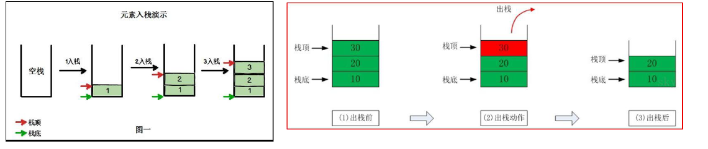
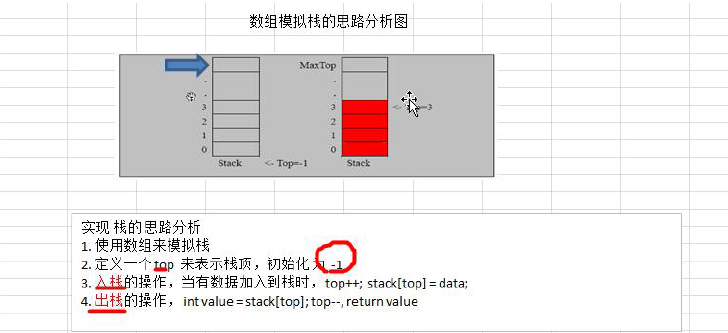
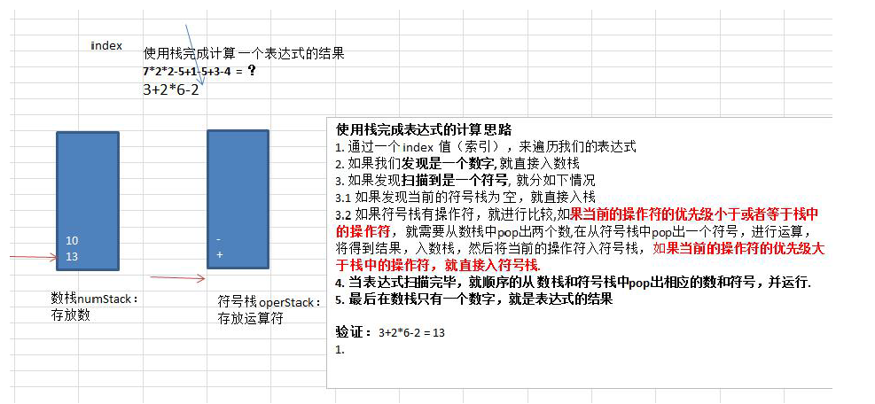

## 栈

### 一、栈的介绍

* 栈的英文为（stack）
* 栈是一个先入后出（FILO-First In Last Out）的有序列表
* 栈是限制线性表中元素的插入和删除只能在线性表的同一端进行的一种特殊线性表。允许插入和删除的一端，为变化的一端，称为栈顶（Top），另一端为固定的一端，称为栈底（Bottom）。
* 根据栈的定义可知，最先放入栈中元素在栈底，最后放入的元素在栈顶，而删除元素刚好相反，最后放入的元素最先删除，最先放入的元素最后删除
* 图解方式说明出栈（pop）和入栈（push）的概念



### 二、栈的应用场景

* 子程序的调用：在跳往子程序前，会先将下个指令的地址存在堆栈中，直到子程序执行完后再将地址取出，以后回到原来的程序中。
* 处理递归调用：和子程序的调用类似，只是除了储存下一个指令的地址外，也将参数、区域变量等数据存入堆栈中。
* 表达式的转换[中缀表达式转后缀表达式]与求值（实际解决）
* 二叉树的遍历
* 图形的深度优先（depth-first）搜索法

### 三、栈的快速入门

1）用数组模拟栈的使用，由于栈是一种有序列表，当然可以使用数组的结构来储存栈的数据内容，下面我们就用数组模拟栈的出栈、入栈等操作

2）实现思路分析，并画出示意图



**代码实现：**

```java
import java.util.Scanner;

//使用数组模拟栈
public class ArrayStackDemo {

	public static void main(String[] args) {
		// 测试
		// 先创建一个ArrayStack对象->表示栈
		ArrayStack stack = new ArrayStack(4);
		String key = "";
		boolean loop = true; // 控制是否退出菜单
		Scanner scanner = new Scanner(System.in);
		while (loop) {
			System.out.println("show：表示显示栈");
			System.out.println("exit：退出程序");
			System.out.println("push：表示添加数据到栈(入栈)");
			System.out.println("pop：表示从栈取出数据(出战)");
			System.out.println("请输入你的选择");
			key = scanner.next();
			switch (key) {
			case "show":
				stack.list();
				break;
			case "push":
				System.out.println("请输入一个数");
				int value = scanner.nextInt();
				stack.push(value);
				break;
			case "pop":
				try {
					int res = stack.pop();
					System.out.printf("出栈的数据是%d\n",res);
				} catch (Exception e) {
					// TODO: handle exception
					System.out.println(e.getMessage());
				}
				break;
			case "exit":
				scanner.close();//防止内存泄漏
				loop = false;
				break;
			default:
				break;
			}
		}
		System.out.println("程序退出~");
	}
}

//定义一个ArrayStack 表示栈
class ArrayStack {
	private int maxSize; // 栈的大小
	private int[] stack; // 数组，数组模拟栈，数据就放在该数组中
	private int top = -1; // top表示栈顶，初始化为-1

	// 构造器
	public ArrayStack(int maxSize) {
		this.maxSize = maxSize;
		stack = new int[this.maxSize];
	}

	// 判断栈满
	public boolean isFull() {
		return top == maxSize - 1;
	}

	// 判断栈空
	public boolean isEmpty() {
		return top == -1;
	}

	// 入栈-push
	public void push(int value) {
		// 先判断栈是否满
		if (isFull()) {
			System.out.println("栈满");
			return;
		}
		top++;
		stack[top] = value;
	}

	// 出栈-pop，将栈顶的数据返回
	public int pop() {
		// 判断栈是否为空
		if (isEmpty()) {
			// 抛出异常
			throw new RuntimeException("栈空，没有数据~");
		}
		int value = stack[top];
		top--;
		return value;
	}

	// 显示栈的情况[遍历栈]，遍历时需要从栈顶开始显示数据
	public void list() {
		if (isEmpty()) {
			System.out.println("栈空，没有数据~~");
			return;
		}
		// 需要从栈顶开始显示数据
		for (int i = top; i >= 0; i--) {
			System.out.printf("stack[%d]=%d\n", i, stack[i]);
		}
	}

}
```

### 四、使用栈实现综合计算机(中缀表达式)

#### 1、使用栈来实现综合计算器

例如：

请输入一个表达式

计算式：`7*2*2-5+1-5+3-3` 点击计算

#### 2、思路分析



#### 3、代码实现

```java
public class Calculator {

	public static void main(String[] args) {
		// TODO Auto-generated method stub
		// 根据思路完成表达式的运算
		String expression = "70+2*6-4"; // 15
		// 创建两个栈，数栈，一个符号栈
		ArrayStack2 numStack = new ArrayStack2(10);
		ArrayStack2 operStack = new ArrayStack2(10);
		// 定义需要的相关变量
		int index = 0; // 用于扫描
		int num1 = 0;
		int num2 = 0;
		int oper = 0;
		int res = 0;
		char ch = ' '; // 将每次扫描得到的char保存到ch
		String keepNum = ""; // 用于拼接多位数
		// 开始while循环的扫面expression
		while (true) {
			// 依次得到expression的每一个字符
			ch = expression.substring(index, index + 1).charAt(0);
			// 判断ch是什么，然后做相应的处理
			if (operStack.isOper(ch)) { // 如果是运算符
				// 判断当前的符号栈是否为空
				if (!operStack.isEmpty()) {
					// 如果符号栈有操作符，就进行比较，如果当前的操作符的优先级小于或者等于栈中的操作符，就需要从数栈中pop出两个数，
					// 在从符号栈中pop出一个符号，进行运算，将得到结果，入数栈，然后将当前的符号入符号栈
					if (operStack.priority(ch) <= operStack.priority(operStack.peek())) {
						num1 = numStack.pop();
						num2 = numStack.pop();
						oper = operStack.pop();
						res = numStack.cal(num1, num2, oper);
						// 将运算的结果如数栈
						numStack.push(res);
						// 将当前的符号入符号栈
						operStack.push(ch);
					} else {
						// 如果当前的操作符的优先级大于栈中的操作符，就直接入符号栈
						operStack.push(ch);
					}
				} else {
					// 如果为空则直接进符号栈
					operStack.push(ch);
				}
			} else { // 如果是数，则直接入数栈
				// numStack.push(ch - 48); // 因为stack保存的是字符的ascii值，需要减48才能得到真正的数字
				// 分析思路
				// 1、当处理多位数，不能发现是一个数就立即入栈，因为他可能是多位数
				// 2、在处理数，需要向expression的表达式的index 后再看一位，如果是数就进行扫描，如果是符号才入栈
				// 3、因此我们需要定义一个变量 字符串变量，用于拼接

				// 处理多位数
				keepNum += ch;
				
				//如果ch已经是expression的最后一位，就直接入栈
				if (index == expression.length() - 1) {
					numStack.push(Integer.parseInt(keepNum));
				} else {					
					// 判断下一个字符是不是数字，如果是数字，就继续扫描，如果是运算符，则入栈
					//注意是看后一位，不是index++
					if (operStack.isOper(expression.substring(index + 1, index + 2).charAt(0))) {
						//如果后一位是运算符，则入栈keepNum = "1" 或者 "123"
						numStack.push(Integer.parseInt(keepNum));
						//重要的一步
						//keepNum情况
						keepNum = "";
					}
				}
			}
			// 让index + 1,并判断是否扫描到expression最后
			index++;
			if (index >= expression.length()) {
				// 扫描遍历结束
				break;
			}
		}
		// 当表达式扫描完毕，就顺序的从数栈和符号栈中pop出相应的数和符号，并运行
		while (true) {
			// 如果符号栈为空，则计算到最后的结果，数栈中只有一个数【结果】
			if (operStack.isEmpty()) {
				break;
			}
			num1 = numStack.pop();
			num2 = numStack.pop();
			oper = operStack.pop();
			res = numStack.cal(num1, num2, oper);
			numStack.push(res);
		}
		// 将数栈的最后数，pop出，就是结果
		System.out.printf("表达式%s = %d", expression, numStack.pop());
	}

}

//先创建一个栈，直接使用前面创建好的
//定义一个ArrayStack2 表示栈，需要扩展功能
class ArrayStack2 {
	private int maxSize; // 栈的大小
	private int[] stack; // 数组，数组模拟栈，数据就放在该数组中
	private int top = -1; // top表示栈顶，初始化为-1

	// 构造器
	public ArrayStack2(int maxSize) {
		this.maxSize = maxSize;
		stack = new int[this.maxSize];
	}

	// 判断栈满
	public boolean isFull() {
		return top == maxSize - 1;
	}

	// 判断栈空
	public boolean isEmpty() {
		return top == -1;
	}

	// 返回栈顶的值peek
	public int peek() {
		return stack[top];
	}

	// 入栈-push
	public void push(int value) {
		// 先判断栈是否满
		if (isFull()) {
			System.out.println("栈满");
			return;
		}
		top++;
		stack[top] = value;
	}

	// 出栈-pop，将栈顶的数据返回
	public int pop() {
		// 判断栈是否为空
		if (isEmpty()) {
			// 抛出异常
			throw new RuntimeException("栈空，没有数据~");
		}
		int value = stack[top];
		top--;
		return value;
	}

	// 显示栈的情况[遍历栈]，遍历时需要从栈顶开始显示数据
	public void list() {
		if (isEmpty()) {
			System.out.println("栈空，没有数据~~");
			return;
		}
		// 需要从栈顶开始显示数据
		for (int i = top; i >= 0; i--) {
			System.out.printf("stack[%d]=%d\n", i, stack[i]);
		}
	}

	// 返回运算符的优先级，优先级是程序员来确定，优先级使用数字来表示
	// 数字越大，则优先级就越大
	public int priority(int oper) {
		if (oper == '*' || oper == '/') {
			return 1;
		} else if (oper == '+' || oper == '-') {
			return 0;
		} else {
			return -1; // 假设目前的表达式只有+，-，*，/
		}
	}

	// 判断是不是一个运算符
	public boolean isOper(char val) {
		return val == '+' || val == '-' || val == '*' || val == '/';
	}

	// 计算方法
	public int cal(int num1, int num2, int oper) {
		int res = 0; // res 用于存放计算的结果
		switch (oper) {
		case '+':
			res = num1 + num2;
			break;
		case '-':
			res = num2 - num1; // 注意顺序
			break;
		case '*':
			res = num1 * num2;
			break;
		case '/':
			res = num2 / num1;
			break;
		default:
			break;
		}
		return res;
	}

}
```

### 五、逆波兰计算器、中缀表达式转换为后缀表达式

#### 1、逆波兰计算器

我们完成一个逆波兰计算器，要求完成如下任务：

1）输入一个逆波兰表达式（后缀表达式），使用栈（stack），计算其结果

2）支持小括号和多位数整数，此处对计算机进行简化，只支持对整数的计算

3）思路分析

例如：`[(3+4)*5-6]`对应的后缀表达式就是`[3 4 + 5 * 6 -]`，针对后缀表达式求值步骤如下：

* 从左至右扫描，将3 和 4 压入堆栈
* 遇到 + 运算符，因此弹出 4 和 3（4为栈顶元素，3为次顶元素），计算出`3 + 4`的值，得7，再将7入栈
* 将5入栈
* 接下来是`*`运算符，因此弹出5和7，计算`7*5=35`，将35入栈
* 将6入栈
* 最后是`-`运算符，计算出`35-6`的值，即29，由此得出最终结果

#### 2、中缀表达式转换为后缀表达式

后缀表达式虽然适合计算式进行运算，但是人却不太容易写出来，尤其是在表达式很长的情况下，因此在开发中，我们需要将中缀表达式转换成后缀表达式

**具体步骤如下：**

1）初始化两个栈：运算符栈s1和储存中间结果的栈s2

2）从左至右扫描中缀表达式

3）遇到操作数时，将其压入s2

4）遇到运算符时，比较其与s1栈顶运算符的优先级

1. 如果s1为空，或栈顶运算符为左括号“ ( ”，则直接将此运算符入栈
2. 否则，若优先级比栈顶运算符的高，也将运算符压入s1
3. 否则，将s1栈顶的运算符弹出并压入到s2中，再次转到`(4-1)`与s1中新的栈顶运算符相比较

5）遇到括号时：

1. 如果是左括号“ ( ”，则直接压入s1
2. 如果是右括号“ ) ”，则依次弹出s1栈顶的运算符，并压入s2，直到遇到左括号为止，此时将这一对括号丢弃

6）重复步骤2至5，直到表达式的最右边

7）将s1中剩余的运算符依次弹出并压入s2

8）依次弹出s2中的元素并输出，结果的逆序即为中缀表达式对应的后缀表达式

#### 3、代码实现

```java
//逆波兰表达式计算
public class PolandNotation {

	public static void main(String[] args) {

		// 完成将一个中缀表达式转成后缀表达式的功能
		// 说明
		// 1.1+((2+3)*4)-5 => 转成1 2 3 + 4 * + 5 -
		// 2.因为直接对str 进行操作，不方便，因此 先将"1+((2+3)*4)-5" => 中缀的表达式对应的List
		// 即"1+((2+3)*4)-5" => ArrayList [1,+,(,(,2,+,3,),*,4,),-,5]
		// 3.将得到的中缀表达式对应的List => 后缀表达式对应的List
		// 即"1+((2+3)*4)-5" => ArrayList [1,2,3,+,4,*,+,5,-]
		String expression = "1+((2+3)*4)-5";
		List<String> infixExpressionList = toInfixExpressionList(expression);
		System.out.println("中缀表达式对应的List" + infixExpressionList);	//ArrayList [1,+,(,(,2,+,3,),*,4,),-,5]
		List<String> suffixExpressionList = parseSuffixExpressionList(infixExpressionList);
		System.out.println("后缀表达式对应的List" + suffixExpressionList);	//ArrayList [1,2,3,+,4,*,+,5,-]

		System.out.printf("expression表达式结果=%d",calculate(suffixExpressionList));
		
//		// TODO Auto-generated method stub
//		//先定义一个逆波兰表达式
//		//后缀表达式
//		//(30+4)*5-6 => 30 4 + 5 * 6 - =>29
//		//为了方便，逆波兰表达式的数字和符号使用空格隔开
//		String suffixExpression = "30 4 + 5 * 6 -";
//		//思路
//		//1、先将“30 4 + 5 * 6 -" => 放入ArrayList中
//		//2、将ArrayList 传递给一个方法，遍历ArrayList配合栈完成计算
//		List<String> rpnList = getListString(suffixExpression);
//		System.out.println("rpnList=" + rpnList);
//		int res = calculate(rpnList);
//		System.out.println("计算的结果是=" + res);

	}

	//// 即"1+((2+3)*4)-5" => ArrayList [1,2,3,+,4,*,+,5,-]
	//重要
	// 方法：将得到的中缀表达式对应的List => 后缀表达式对应的List
	public static List<String> parseSuffixExpressionList(List<String> ls) {
		// 定义两个栈
		Stack<String> s1 = new Stack<String>(); // 符号栈
		// 说明：因为s2这个栈，在整个转换过程中，没用pop操作，而且后面我们还需要逆序输出
		// 因此比较麻烦，这里我们就不用Stack<String> 直接使用List<String> s2
		// Stack<String> s2 = new Stack<String>(); //储存中间的结果的栈s2
		List<String> s2 = new ArrayList<String>(); // 储存中间的结果的Lists2

		// 遍历ls
		for (String item : ls) {
			// 如果是一个数，就加入s2
			if (item.matches("\\d+")) {
				s2.add(item);
			} else if (item.equals("(")) {
				// 如果是左括号"("，则直接压入栈s1
				s1.push(item);
			} else if (item.equals(")")) {
				// 如果是右括号")"，则依次弹出s1栈顶的运算符，并压入s2，直到遇到左括号为止，此时将这一对括号丢弃
				while (!s1.peek().equals("(")) {
					s2.add(s1.pop());
				}
				s1.pop();	//!!将 ( 弹出s1栈，消除小括号
			} else {
				// 当item的优先级小于等于栈顶运算符，将s1栈顶的运算符弹出并加入到s2中，再次转到（4.1）与s1中新的栈顶运算符相比较
				// 问题：我们缺少一个比较优先级高低的方法
				while(s1.size() != 0 && Operation.getValue(s1.peek()) >= Operation.getValue(item)) {
					s2.add(s1.pop());
				}
				//还需要将item压入栈
				s1.push(item);
			}
		}
		
		//将s1中剩余的运算符依次弹出并加入s2
		while (s1.size() > 0) {
			s2.add(s1.pop());
		}
		
		return s2;	//注意因为是存放到List，因此按顺序输出就是对应的后缀表达式对应的list
		
	}

	// 方法：将中缀表达式转成对应的list
	//重要
	public static List<String> toInfixExpressionList(String s) {
		// 定义一个List，存放中缀表达式，对应的内容
		List<String> ls = new ArrayList<String>();
		int i = 0; // 这是一个指针，用于遍历中缀表达式字符串
		String str; // 对多位数的拼接
		char c; // 每遍历到一个字符，就放入到c
		do {
			// 如果c是一个非数字，就需要加入到ls
			if ((c = s.charAt(i)) < 48 || (c = s.charAt(i)) > 57) {
				ls.add("" + c);
				i++; // i需要后移
			} else {
				// 如果是一个数，需要考虑多位数的问题
				str = ""; // 先将str 置成"" '0'[48] -> '9'[57]
				while (i < s.length() && (c = s.charAt(i)) >= 48 && (c = s.charAt(i)) <= 57) {
					str += c; // 拼接
					i++;
				}
				ls.add(str);
			}
		} while (i < s.length());
		return ls;
	}

	// 将一个逆波兰表达式，依次将数据和运算符放入到ArrayList中
	public static List<String> getListString(String suffixExpression) {
		// 将suffixExpression 分割，按空格进行分割
		String[] split = suffixExpression.split(" ");
		List<String> list = new ArrayList<String>();
		for (String ele : split) {
			list.add(ele);
		}
		return list;
	}

	// 完成对逆波兰表达式的运算
	/**
	 * 1）从左至右扫描，将3 和 4 压入栈 2）遇到+运算符，因此弹出4和3（4为栈顶元素，3为次顶元素），计算3+4的值，得7，再将7入栈 3）将5入栈
	 * 4）接下来是*运算符，因此弹出5和7，计算7*5=35，将35入栈 5）将6入栈 6）最后是-运算符，计算出35-6的值，即29，由此得出最终结果
	 */
	public static int calculate(List<String> ls) {
		// 创建一个栈
		Stack<String> stack = new Stack<String>();
		// 遍历
		for (String item : ls) {
			// 这里使用正则表达式来取出数
			if (item.matches("\\d+")) { // 匹配的是多位数
				// 入栈
				stack.push(item);
			} else {
				// pop出两个数，并运算，再入栈
				int num2 = Integer.parseInt(stack.pop());
				int num1 = Integer.parseInt(stack.pop());
				int res = 0;
				if (item.equals("+")) {
					res = num1 + num2;
				} else if (item.equals("-")) {
					res = num1 - num2;
				} else if (item.equals("*")) {
					res = num1 * num2;
				} else if (item.equals("/")) {
					res = num1 / num2;
				} else {
					throw new RuntimeException("运算符有误");
				}
				// 把res 入栈
				stack.push(res + "");
			}
		}
		// 最后留在stack中的数据是运算结果
		return Integer.parseInt(stack.pop());
	}

}

//编写一个类Operation 可以返回一个运算符 对应的优先级
class Operation {
	private static int ADD = 1;
	private static int SUB = 1;
	private static int MUL = 2;
	private static int DIV = 2;
	
	//写一个方法，返回对应的优先级数字
	public static int getValue(String operation) {
		int result = 0;
		switch (operation) {
		case "+":
			result = ADD;
			break;
		case "-":
			result = SUB;
			break;
		case "*":
			result = MUL;
			break;
		case "/":
			result = DIV;
			break;
		default:
			System.out.println("不存在该运算符");
			break;
		}
		return result;
	}
}
```

