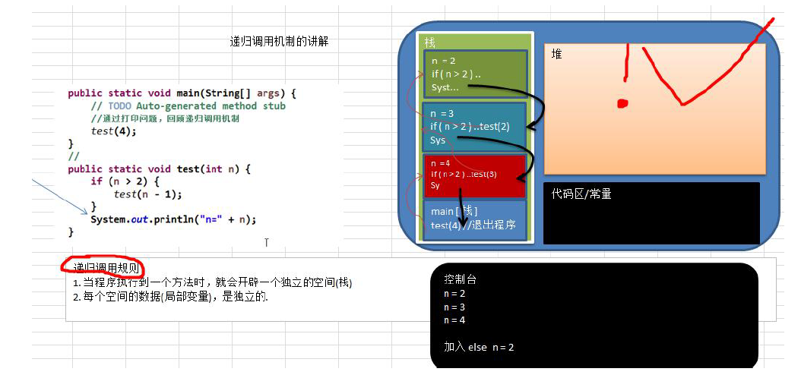
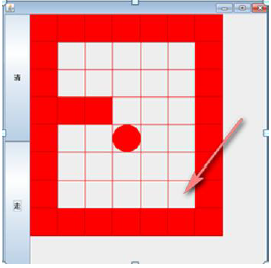
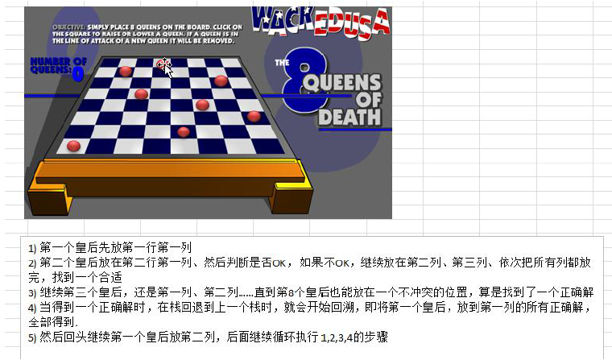

## 递归

### 一、递归的概念

递归就是方法自己调用自己，每次调用时传入不同的变量。递归有助于编程者解决复杂的问题，同时可以让代码变得简洁。

### 二、递归调用机制



### 三、代码演示

```java
public class RecursionTest {

	public static void main(String[] args) {
		// TODO Auto-generated method stub
		//通过打印问题，回顾递归调用机制
//		test(4);
		
		int res = factorial(2);
		System.out.println("res=" + res);
	}
	
	//打印问题
	public static void test(int n) {
		if (n > 2) {
			test(n - 1);
		}
		System.out.println("n=" + n);
	}
	
	//阶层问题
	public static int factorial(int n) {
		if (n == 1) {
			return 1;
		} else {
			return factorial(n -1) * n; //1*2*3*4*..*n
		}
	}

}
```

### 四、递归用于解决的问题

1）各种数学问题如：8 皇后问题，汉诺塔，阶乘问题，迷宫问题，球和篮子的问题(google编程大赛)

2）各种算法中也会使用到递归，比如快排，归并排序，二分查找，分治算法等

3）将用栈解决的问题-->递归代码比较简洁

### 五、递归需要遵守的重要规则

1）执行一个方法时，就创建一个新的受保护的独立空间(栈空间)

2）方法的局部变量是独立的，不会相互影响，比如n变量

3）如果方法中使用的是引用类型变量(比如数组)，就会共享该引用类型的数据

4）**递归必须向退出递归的条件逼近**，否则就会无限递归，出现StackOverflowError

5）当一个方法执行完毕，或者遇到return，就会返回，遵守谁调用，就将结果返回谁，同时当方法执行完毕或者返回时，该方法也就执行完毕

### 六、迷宫问题

#### 6.1、思路

1）小球得到的路径，和程序员设置的找路策略有关即：找路的上下左右的顺序相关

2）再得到小球路径时，可以先使用(下右上左)，再改成(上右下左)，看看路径是不是有变化

3）测试回溯现象

4）思考：如何求出最短路径



#### 6.2、代码实现

```java
public class MiGong {

	public static void main(String[] args) {
		// TODO Auto-generated method stub
		// 先创建一个二维数组，模拟迷宫
		int[][] map = new int[8][7];
		// 使用1表示墙
		// 上下全部置为1
		for (int i = 0; i < 7; i++) {
			map[0][i] = 1;
			map[7][i] = 1;
		}
		
		//左右全部置为一
		for(int i = 0; i < 8; i++) {
			map[i][0] = 1;
			map[i][6] = 1;
		}
		//设置挡板，1表示
		map[3][1] = 1;
		map[3][2] = 1;
		//加入以下挡板则走不通，进行了回溯
//		map[1][2] = 1;
//		map[2][2] = 1;
		//输出地图
		for (int i = 0; i < 8; i++) {
			for (int j = 0; j < 7; j++) {
				System.out.printf(map[i][j] + " ");
			}
			System.out.println();
		}
		
		//使用递归回溯给小球找路
//		setWay(map,1,1);
		setWay2(map,1,1);
		
		//输出新的地图，小球走过，并标识过的递归
		System.out.println("小球走过，并标识过的地图的情况");
		for (int i = 0; i < 8; i++) {
			for (int j = 0; j < 7; j++) {
				System.out.printf(map[i][j] + " ");
			}
			System.out.println();
		}
		
	}
	
	//使用递归回溯来给小球找路
	//说明
	//1. map 表示地图
	//2. i,j 表示从地图的哪个位置开始出发(1,1)
	//3. 如果小球能到 map[6][5] 位置，则说明通路找到
	//4. 约定：当map[i][j] 为 0 表示该点没有走过，当为1表示墙；2表示通路可以走；3表示该点已经走过，当时走不通
	//5. 在走迷宫时，需要确定一个策略(方法) 下->右->上->左，如果该点走不通，再回溯
	/**
	 * 
	 * @param map 表示地图
	 * @param i 从哪个位置开始找
	 * @param j 
	 * @return 如果找到通路，就返回true，否则返回false
	 */
	public static boolean setWay(int[][] map, int i, int j) {
		if (map[6][5] == 2) {
			//通路已经找到ok
			return true;
		} else {
			if (map[i][j] == 0) {
				//如果当前这个点还没有走过
				//按照策略 下->右->上->左 走
				map[i][j] = 2;	//假定该点是可以走通
				if (setWay(map,i+1,j)) {
					//向下走
					return true;
				} else if (setWay(map,i,j+1)) {
					//向右走
					return true;
				} else if (setWay(map,i-1,j)) {
					//向上走
					return true;
				} else if (setWay(map,i,j-1)) {
					//向左走
					return true;
				} else {
					//说明该点是走不通，是死路
					map[i][j] = 3;
					return false;
				}
			} else {
				//如果map[i][j] != 0，可能是1，2，3
				return false;
			}
		}
	}
	
	//修改找路的策略，改成上->右->下->左
	public static boolean setWay2(int[][] map, int i, int j) {
		if (map[6][5] == 2) {
			//通路已经找到ok
			return true;
		} else {
			if (map[i][j] == 0) {
				//如果当前这个点还没有走过
				//按照策略 下->右->上->左 走
				map[i][j] = 2;	//假定该点是可以走通
				if (setWay2(map,i-1,j)) {
					//向上走
					return true;
				} else if (setWay2(map,i,j+1)) {
					//向右走
					return true;
				} else if (setWay2(map,i+1,j)) {
					//向下走
					return true;
				} else if (setWay2(map,i,j-1)) {
					//向左走
					return true;
				} else {
					//说明该点是走不通，是死路
					map[i][j] = 3;
					return false;
				}
			} else {
				//如果map[i][j] != 0，可能是1，2，3
				return false;
			}
		}
	}

}
```

### 七、八皇后问题

#### 7.1、问题介绍

该问题是国际西洋棋棋手马克斯 * 贝琵尔于1848年提出：在8 * 8格的国际象棋上摆放八个皇后，使其不能相互攻击，即：**任意两个皇后都不能处于同一行、同一列或同一斜线上，问有多少种摆法(92)** 

####7.2、算法思路分析

1）第一个皇后先放第一行第一列

2）第二个皇后放在第二行第一列，然后判断是否OK，如果不OK，继续放在第二列、第三列、依次把所有列都放完，找到一个合适的

3）继续第三个皇后，还是第一列、第二列......直到第8个皇后也能放在一个不冲突的位置，算是找到了一个正确解

4）当得到一个正确解时，在栈回退到上一个栈时，就会开始回溯，即将第一个皇后，放到第一列的所有正确解，全部得到

5）然后回头继续第一个皇后放第二列 ，后面继续循环执行 1，2，3，4的步骤

6）示意图：



**说明**：

理论上应该创建一个二维数组来表示棋盘，但是实际上可以通过算法，用一个一维数组即可解决问题。arr[8] = {0,4,7,5,2,6,1,3}，对应arr下标表示第几行，即第几个皇后，arr[i] = val，val表示第 i+1 个皇后，放在第 i + 1 行的第val + 1列

#### 7.4、代码实现

```java
public class Queue8 {

	// 定义一个max表示共有多少个皇后、
	int max = 8;
	// 定义数组array，保存皇后放置位置的结果，比如 arr[8] = {0,4,7,5,2,6,1,3}
	// 数组下标表示皇后所在的行，数组的元素表示皇后所在的列
	int[] array = new int[max];
	static int count = 0;
	static int judgeCount = 0;
	
	public static void main(String[] args) {
		// TODO Auto-generated method stub
		Queue8 queue8 = new Queue8();
		queue8.check(0);
		System.out.printf("一共有%d种解法",count);
		System.out.printf("一共判断了%d次",judgeCount);
	}

	// 编写一个方法，放置 第n个皇后
	//特别注意：check 是 每一次递归时，进入到check中都有 for(int i = 0; i < max; i++)，因此会有回溯
	private void check(int n) {
		if (n == max) {
			// n = 8，其实8个皇后就已经放好
			print();
			return;
		}

		// 依次放入皇后，并判断是否冲突
		for (int i = 0; i < max; i++) {
			// 先把当前这个皇后n，放到该行的第1列
			array[n] = i;
			// 判断当放置第n个皇后到i列时，是否冲突
			if (judge(n)) {
				//不冲突
				//接着放n+1个皇后，即开始递归
				check(n+1);
			}
			//如果冲突，就继续执行 array[n] = i; 即将第n个皇后，放置在本行的后移的一个位置
			
		}
	}

	// 查看当我们放置第n个皇后，就去检测该皇后是否和前面已经摆放的皇后冲突
	/**
	 * 
	 * @param n 表示第n个皇后
	 * @return
	 */
	private boolean judge(int n) {
		judgeCount++;
		for (int i = 0; i < n; i++) {
			// 说明
			// 1. array[i] == array[n] 表示判断 第n个皇后是否和前面的n-1个皇后在同一列
			// 2. Math.abs(n-i) == Math.abs(array[n] - array[i]
			// 表示判断第n个皇后是否和第i个皇后在同一斜线，若为同一斜线|x-xi| = |y-yi|
			// n = 1 array[1] = 1
			// Math.abs(1-0) == 1, Math.abs(array[n] - array[i]) = Math.abs(1-0) = 1
			if (array[i] == array[n] || Math.abs(n - i) == Math.abs(array[n] - array[i])) {
				return false;
			}
		}
		return true;
	}

	// 写一个方法，可以将皇后摆放的位置输出
	private void print() {
		count++;
		for (int i = 0; i < array.length; i++) {
			System.out.print(array[i] + " ");
		}
		System.out.println();
	}

}
```

