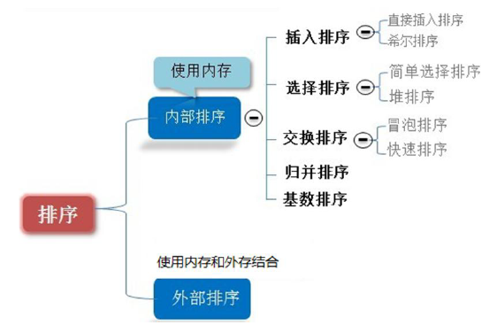

## 排序算法介绍

### 一、排序算法的介绍

排序也称排序算法，排序是将一组数据，依指定的顺序进行排列的过程

### 二、排序的分类

1）内部排序：

指将需要处理的所有数据都加载到内部存储器(内存)中进行排序。

2）外部排序法：

数据量过大，无法全部加载到内存中，需要借助外部存储(文件等)进行排序。

3）常见的排序算法分类：

### 三、算法的时间复杂度

#### 3.1、度量一个程序(算法)执行时间的两种方法

1）事后统计的方法

这种方法可行，但是有两个问题：一是要想对设计的算法的运行性能进行评测，需要实际运行该程序；二是所得时间的统计量依赖于计算机的硬件、软件等环境因素，这种方式，要在同一台计算机的相同状态下运行，才能比较哪个算法速度更快。

2）事前估算的方法

通过分析某个算法的时间复杂度来判断哪个算法更优

#### 3.2、时间频度

1）基本介绍

时间频度：一个算法花费的时间与算法中语句的执行次数成正比例，哪个算法中语句执行次数多，它花费时间就多。一个算法中的语句执行次数称为语句频度或时间频度。记为T(n)

2）举例说明

* 基本案例：比如计算1-100所有数字之和，我们设计两种算法

* 忽略常数项

结论：

1）`2n + 20`和 2n 随着 n 变大，执行曲线无线接近，20 可以忽略

2）`3n + 10` 和 3n 随着 n 变大，执行曲线无线接近，10可以忽略

* 忽略低次项

结论：

1）`2n^2 + 3n + 10` 和 `2n^2`随着 n 变大，执行曲线无限接近，可以忽略 `3n + 10`

2）`n^2 + 5n +20` 和 `n^2` 随着 n 变大，执行曲线无限接近，可以忽略 `5n + 20`

* 忽略系数

结论：

1）随着 n 值变大，`5n^2 + 7n` 和 `3n^2 + 2n`，执行曲线重合，说明这种情况下，5和3可以忽略

2）而`n^3 + 5n` 和 `6n^3 + 4n`，执行曲线分离，说明多少次方是关键

#### 3.3、时间复杂度

1)  一般情况下，**算法中的基本操作语句的重复执行次数是问题规模** **n** **的某个函数**，用 T(n)表示，若有某个辅助函数 f(n)，使得当 n 趋近于无穷大时，T(n) / f(n) 的极限值为不等于零的常数，则称 f(n)是 T(n)的同数量级函数。记作 **T(n)=Ｏ( f(n) )**，称Ｏ( f(n) ) 为算法的渐进时间复杂度，简称时间复杂度。

2)  T(n) 不同，但时间复杂度可能相同。 如：T(n)=n²+7n+6 与 T(n)=3n²+2n+2 它们的 T(n) 不同，但时间复杂度相同，都为 **O(n^2)**。

3)  计算时间复杂度的方法：

* 用常数 1 代替运行时间中的所有加法常数 T(n)=n²+7n+6  => T(n)=n²+7n+1

* 修改后的运行次数函数中，只保留最高阶项 T(n)=n²+7n+1 => T(n) = n²

* 去除最高阶项的系数 T(n) = n² => T(n) = n² => O(n²)

#### 3.4、常见的时间复杂度

1)  常数阶 O(1)

2)  对数阶 O(log2n)

3)  线性阶 O(n)

4)  线性对数阶 O(nlog2n)

5)  平方阶 O(n^2)

6)  立方阶 O(n^3)

7)  k 次方阶 O(n^k)

8)  指数阶 O(2^n)

**常见的时间复杂度对应的图**

**说明**：

1)  常见的算法时间复杂度由小到大依次为：Ο(1)＜Ο(log2n)＜Ο(n)＜Ο(nlog2n)＜Ο(n2)＜Ο(n3)＜ Ο(nk) ＜ Ο(2n) ，随着问题规模 n 的不断增大，上述时间复杂度不断增大，算法的执行效率越低

2)  从图中可见，我们应该尽可能避免使用指数阶的算法

① 常数阶 O(1)

② 对数阶 O(log2n)

 

③线性阶 O(n)

 

④线性对数阶 O(nlogN)

 

⑤ 平方阶 O(n²)

 

⑥立方阶 O(n³)、K 次方阶 O(n^k)

说明：参考上面的 O(n²) 去理解就好了，O(n³)相当于三层 n 循环，其它的类似

#### 3.5、平均时间复杂度和最坏时间复杂度

1）平均时间复杂度是指所有可能的输入实例均以等概率出现的情况下，该算法的运行时间。

2）最坏情况下的时间复杂度称最坏时间复杂度。**一般讨论的时间复杂度均是最坏情况下的时间复杂度**。这样做的原因是：最坏情况下的时间复杂度是算法在任何输入实例上运行时间的界限，这就保证了算法的运行时间不会比最坏情况更长。

3）平均时间复杂度和最坏时间复杂度是否一致，和算法有关(如图:)：

### 四、算法的空间复杂度

1)  类似于时间复杂度的讨论，一个算法的空间复杂度(Space Complexity)定义为该算法所耗费的存储空间，它也是问题规模 n 的函数。

2)  空间复杂度(Space Complexity)是对一个算法在运行过程中临时占用存储空间大小的量度。有的算法需要占用的临时工作单元数与解决问题的规模 n 有关，它随着 n 的增大而增大，当 n 较大时，将占用较多的存储单元，例如快速排序和**归并排序算法**，**基数排序**就属于这种情况

3)  在做算法分析时，主要讨论的是时间复杂度。**从用户使用体验上看，更看重的程序执行的速度**。一些缓存产品(redis, memcache)和算法(基数排序)**本质就是用空间换时间**.

### 五、常用排序算法总结和对比

**相关术语解释：**

1)  稳定：如果 a 原本在 b 前面，而 a=b，排序之后 a 仍然在 b 的前面；

2)  不稳定：如果 a 原本在 b 的前面，而 a=b，排序之后 a 可能会出现在 b 的后面；

3)  内排序：所有排序操作都在内存中完成；

4)  外排序：由于数据太大，因此把数据放在磁盘中，而排序通过磁盘和内存的数据传输才能进行；

5)  时间复杂度： 一个算法执行所耗费的时间。

6)  空间复杂度：运行完一个程序所需内存的大小。

7)  n: 数据规模

8)  k: “桶”的个数

9)  In-place:    不占用额外内存

10) Out-place: 占用额外内存