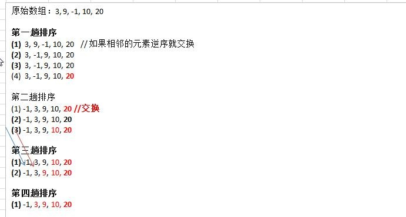

### 一、基本介绍

冒泡排序（Bubble Sorting）的基本思想是：通过对待排序序列从前向后（从下标较小的元素开始）,**依次比较相邻元素的值，若发现逆序则交换**，使值较大的元素逐渐从前移向后部，就象水底下的气泡一样逐渐向上冒。

**优化：**
因为排序的过程中，各元素不断接近自己的位置，**如果一趟比较下来没有进行过交换，就说明序列有序**，因此要在排序过程中设置一个标志 flag 判断元素是否进行过交换。从而减少不必要的比较。(这里说的优化，可以在冒泡排序写好后，在进行)

**图解：**


小结上面的图解过程:
(1)  一共进行 数组的大小-1 次 大的循环
(2) 每一趟排序的次数在逐渐的减少
(3)  如果我们发现在某趟排序中，没有发生一次交换， 可以提前结束冒泡排序。这个就是优化

个人理解：即在每一次大循环中将**最大的值**放在本次循环的末尾下标（最后值的下标为arr.length - i），循环arr.length - 1次

### 二、代码实现

```java
	// 将前面的冒泡排序算法，封装成一个方法
	public static void bubbleSort(int[] arr) {
		int temp = 0; // 临时变量
		boolean flag = false; // 标识变量，表示是否进行了交换
		for (int i = 0; i < arr.length - 1; i++) {
			for (int j = 0; j < arr.length - 1 - i; j++) {
				if (arr[j] > arr[j + 1]) {
					flag = true;
					temp = arr[j];
					arr[j] = arr[j + 1];
					arr[j + 1] = temp;
				}
			}
			if (!flag) {
				// 在一趟排序中，一次交换都没有发生过
				break;
			} else {
				flag = false; // 重置flag，进行下次判断
			}
//			System.out.printf("第%d趟排序后的数组:", i + 1);
//			System.out.println(Arrays.toString(arr));
		}
		System.out.println("最终排序结果：" + Arrays.toString(arr));
	}
```

