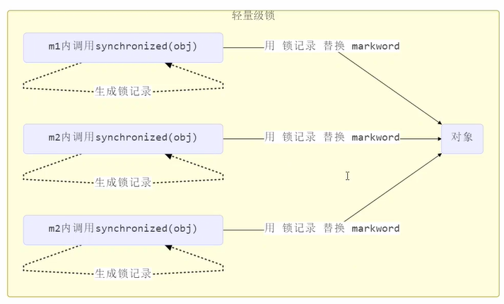

## synchronized 原理进阶

### 一、轻量级锁

轻量级锁的 Mark Word 结构为：

**cas 操作是原子性的，不会被打断**

### 二、锁膨胀

### 三、自旋优化

### 四、偏向锁

特点：直接查看对象头中的线程 id 是否一致，一致则不需要重新CAS

**ps：cas操作有性能损耗**

#### 4.1、偏向状态

#### 4.2、撤销 - 调用对象 hashCode

#### 4.3、撤销 - 其他线程使用对象

#### 4.4、撤销 - 调用 wait/notify

因为 wait/notify 方法只用重量级锁才有

#### 4.5、批量重偏向

#### 4.6、批量撤销

### 五、锁消除

- 锁消除是发生在编译器级别的一种锁优化方式。
- 有时候我们写的代码完全不需要加锁，却执行了加锁操作。
- JIT 即时编译器会对代码进行优化，进行锁消除。

