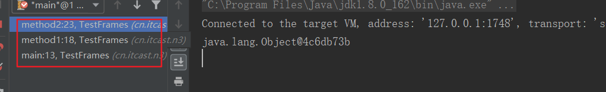
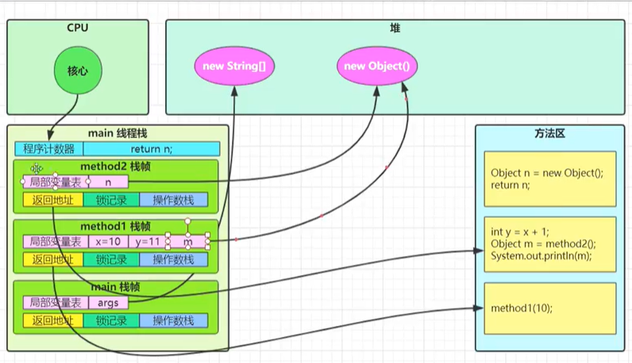

### 一、创建和运行线程

#### 方法一、直接使用Thread

```java
//创建线程对象
Thread t = new Thread() {
    public void run() {
        //要执行的任务
    }
};
//启动线程
t.start();
```

例如：

```java
//创建线程
Thread t = new Thread() {
    @Override
    public void run() {
        log.debug("running");
    }
};

//指定线程名称
t.setName("t1");
t.start();
```

输出：

```
00:40:18.005 c.Test1 [t1] - running
```

#### 方法二、使用Runnable配合Thread

把【线程】和【任务】（要执行的代码）分开

* Thread 代表线程
* Runnable 可运行的任务（线程要执行的代码）

```java
Runnable runnable = new Runnable() {
	public void run(){
		// 要执行的任务
	}
};
// 创建线程对象，实际上还是使用了Thread中的run方法，如果有Runnable，就优先执行Runnable
Thread t = new Thread( runnable );
// 启动线程
t.start();
```

例如：

```java
// 创建任务对象
Runnable task2 = new Runnable() {
    @Override
    public void run() {
    	log.debug("hello");
    }
};

// 参数1 是任务对象; 参数2 是线程名字，推荐
Thread t2 = new Thread(task2, "t2");
t2.start();
```

输出：

```java
19:19:00 [t2] c.ThreadStarter - hello
```

Java8 以后可以使用 lambda 精简代码

```java
// 创建任务对象，使用lambda精简代码
Runnable task2 = () -> log.debug("hello");

// 参数1 是任务对象; 参数2 是线程名字，推荐
Thread t2 = new Thread(task2, "t2");
t2.start();
```

**原理：Thread 与 Runnable 的关系**

分析 Thread 源码，理清它与 Runnable 的关系

**小结：**

* 方法1 是把线程和任务合并在了一起，方法2是把线程和任务分开了
* 用 Runnable 更容易与线程池等高级API配合
* 用 Runnable 让任务类脱离了 Thread 继承体系，更灵活

#### 方法三、FutureTask 配合 Thread

FutureTask 能够接收 Callable 类型的参数，用来处理有返回结果的情况

```java
//创建任务对象
FutureTask<Integer> task = new FutureTask<>(new Callable<Integer>() {
    @Override
    public Integer call() throws Exception {
        log.debug("running...");
        Thread.sleep(1000);
        return 100;
    }
});

// 参数1 是任务对象; 参数2 是线程名字，推荐
Thread t = new Thread(task,"t1");
t.start();

log.debug("{}",task.get());
```

输出：

```
01:19:35.506 c.Test1 [t1] - running...
01:19:36.511 c.Test1 [main] - 100
```

### 二、观察多个线程同时运行

```java
new Thread(() -> {
    while(true) {
        log.debug("running");
    }
},"t1").start();
new Thread(() -> {
    while(true) {
        log.debug("running");
    }
},"t2").start();
```

主要是理解

* 交替执行
* 谁先谁后，不由我们控制

### 三、查看进程线程的方法

**windows**

* 任务管理器可以查看进程和线程数，也可以用来杀死进程
* `tasklist`查看进程
* `taskkill`杀死进程

**linux**

* `ps -fe`查看所有进程
* `ps -fT -p <PID>`查看某个进程（PID）的所有线程
* `kill`杀死进程
* `top`按大写H切换是否显示线程
* `top -H -p <PID>`查看某个进程（PID）的所有线程

**java**

* `jps`命令查看所有java进程
* `jstask <PID>`查看某个java进程（PID）的所有线程状态
* `jconsole`来查看某个java进程中线程的运行状况（图形界面）

jconsole 远程监控配置

* 需要以如下方式运行你的 java 类

```
java -Djava.rmi.server.hostname=`ip地址` -Dcom.sun.management.jmxremote -
Dcom.sun.management.jmxremote.port=`连接端口` -Dcom.sun.management.jmxremote.ssl=是否安全连接 -
Dcom.sun.management.jmxremote.authenticate=是否认证 java类
```

* 修改 /etc/hosts 文件将 127.0.0.1 映射至主机名

如果要认证访问，还需要做如下步骤：

* 复制 jmxremote.password 文件
* 修改 jmxremote.password 和 jmxremote.access 文件的权限为 600 即文件所有者可读写
* 连接时填入 controlRole（用户名），R&D（密码）

### 四、栈与栈帧

Java Virtual Machine Stacks （Java 虚拟机栈）

我们都知道 JVM 中由堆、栈、方法区所组成，其中栈内存是给谁用的呢？其实就是线程，每个线程启动后，虚拟
机就会为其分配一块栈内存。（**即一个执行方法创建一个栈帧，每个线程都有自己独立的栈内存，栈内存有多个栈帧，每个栈内存相互独立**）

* 每个栈由多个栈帧（Frame）组成，对应着每次方法调用时所占用的内存
* 每个线程只能有一个活动栈帧，对应着当前正在执行的那个方法

```java
public static void main(String[] args) {
    Thread t1 = new Thread(){
        @Override
        public void run() {
            method1(20);
        }
    };
    t1.setName("t1");
    t1.start();
    method1(10);
}

private static void method1(int x) {
    int y = x + 1;
    Object m = method2();
    System.out.println(m);
}

private static Object method2() {
    Object n = new Object();
    return n;
}
```

debug：



**图解：**



### 五、线程上下文切换（Thread Context Switch）

因为以下一些原因导致 cpu 不再执行当前的线程，转而执行另一个线程的代码

* 线程的 cpu 时间片用完
* 垃圾回收
* 有更高优先级的线程需要运行
* 线程自己调用了 sleep、yield、wait、join、park、synchronized、lock 等方法

当 Context Switch 发生时，需要由操作系统保存当前线程的状态，并恢复另一个线程的状态，Java 中对应的概念
就是程序计数器（Program Counter Register），它的作用是记住下一条 jvm 指令的执行地址，是线程私有的

* 状态包括程序计数器、虚拟机栈中每个栈帧的信息，如局部变量、操作数栈、返回地址等、
* Context Switch 频繁发生会影响性能