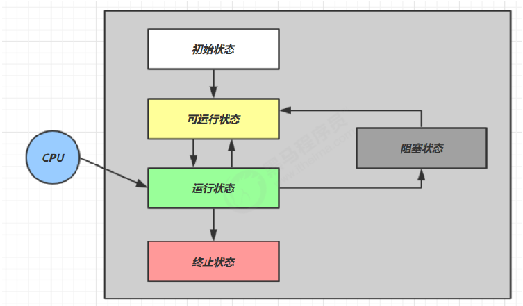

## 线程的状态：五种状态（操作系统层面）

* 【初始状态】仅是在语言层面创建了线程对象，还未与操作系统线程关联
* 【可运行状态】（就绪状态）指该线程已经被创建（与操作系统线程关联），可以由 CPU 调度执行
* 【运行状态】指获取了 CPU 时间片运行中的状态
  * 当 CPU 时间片用完，会从【运行状态】转换至【可运行状态】，会导致线程的上下文切换
* 【阻塞状态】
  * 如果调用了阻塞 API，如 BIO 读写文件，这时该线程实际不会用到 CPU，会导致线程上下文切换，进入
    【阻塞状态】
  * 等 BIO 操作完毕，会由操作系统唤醒阻塞的线程，转换至【可运行状态】
  * 与【可运行状态】的区别是，对【阻塞状态】的线程来说只要它们一直不唤醒，调度器就一直不会考虑
    调度它们
* 【终止状态】表示线程已经执行完毕，生命周期已经结束，不会再转换为其它状态

