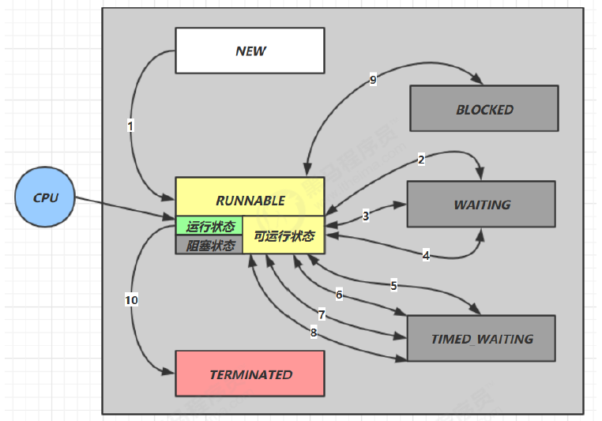

## 线程状态：六种状态（Java API 层面）

这是从 **Java API** 层面来描述的

根据 Thread.State 枚举，分为六种状态

* `NEW `线程刚被创建，但是还没有调用 start() 方法
* `RUNNABLE` 当调用了 `start() `方法之后，注意，Java API 层面的 `RUNNABLE` 状态涵盖了 操作系统 层面的
  【可运行状态】、【运行状态】和【阻塞状态】（由于 BIO 导致的线程阻塞，在 Java 里无法区分，仍然认为
  是可运行）
* `BLOCKED` ， `WAITING` ， `TIMED_WAITING `都是 Java API 层面对【阻塞状态】的细分，后面会在状态转换一节
  详述
* `TERMINATED `当线程代码运行结束

