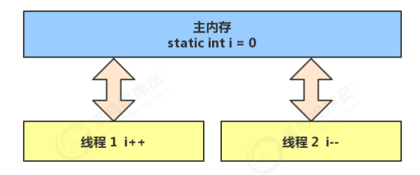
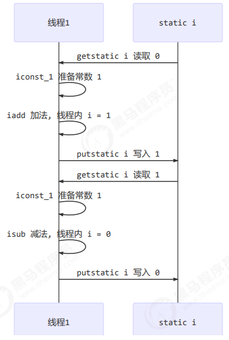
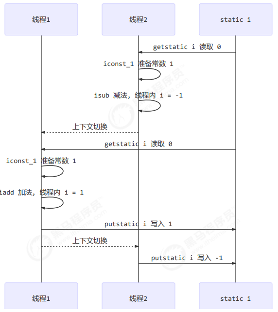
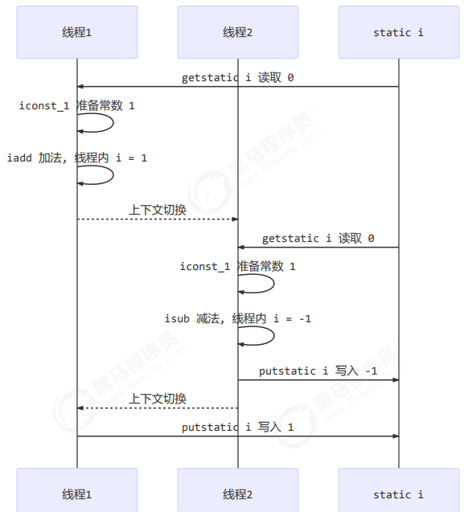

## 共享模型之管程（共享问题）

### 一、什么是管程？

简单来说就是**管理共享资源的访问过程**。

管程是一个抽象的概念模型，其封装了一套对共享资源访问的模型，目的是**通过一个模型来管理共享资源的访问过程**，让可能存在多个进程或线程同时访问一个共享资源时能达到"互斥"和"同步"的效果,管程实现管程模型必须达到下面两点要求：

1. 管程中的共享变量对于外部都是不可见的，只能通过管程才能访问对应的共享资源。
2. 管程是互斥的，某个时刻只能允许一个进程或线程访问共享资源。
3. 管程中需要有线程等待队列和相应等待和唤醒操作。
4. 必须有一种办法使进程无法继续运行时被阻塞。

### 二、共享带来的问题？

在 Java 中的体现：

两个线程对初始值为 0 的静态变量一个做自增，一个做自减，各做 5000 次，结果是 0 吗？

```java
static int counter = 0;
public static void main(String[] args) throws InterruptedException {
    Thread t1 = new Thread(() -> {
        for (int i = 0; i < 5000; i++) {
            counter++;
        }
    }, "t1");
    Thread t2 = new Thread(() -> {
        for (int i = 0; i < 5000; i++) {
            counter--;
        }
    }, "t2");
    t1.start();
    t2.start();
    t1.join();
    t2.join();
    log.debug("{}",counter);
}
```

**问题分析：**

以上的结果可能是正数、负数、零。为什么呢？因为 Java 中对静态变量的自增，自减并不是原子操作，要彻底理解，必须从字节码来进行分析 

例如对于 `i++` 而言（`i`为静态变量），实际会产生如下的 JVM 字节码指令：

```java
getstatic i // 获取静态变量i的值
iconst_1 // 准备常量1
iadd // 自增
putstatic i // 将修改后的值存入静态变量i
```

而对应 `i--` 也是类似：

```java
getstatic i // 获取静态变量i的值
iconst_1 // 准备常量1
isub // 自减
putstatic i // 将修改后的值存入静态变量i
```

而 Java 的内存模型如下，完成静态变量的自增，自减需要在主存和工作内存中进行数据交换：



如果是单线程以上 8 行代码是顺序执行（不会交错）没有问题：



但多线程下这 8 行代码可能交错运行： 

出现负数的情况：



出现正数的情况：



### 三、临界区（存在对共享资源的多线程读写操作的代码块）

* 一个程序运行多个线程本身是没有问题的 

* 问题出在多个线程访问共享资源 

  * 多个线程读共享资源其实也没有问题 
  * 在多个线程对共享资源读写操作时发生**指令交错**，就会出现问题 

* 一段代码块内如果**存在对共享资源的多线程读写操作**，称这段代码块为临界区 

例如，下面代码中的临界区：

```java
static int counter = 0;
static void increment()
// 临界区
{
    counter++;
}
static void decrement()
// 临界区
{
    counter--;
}
```


