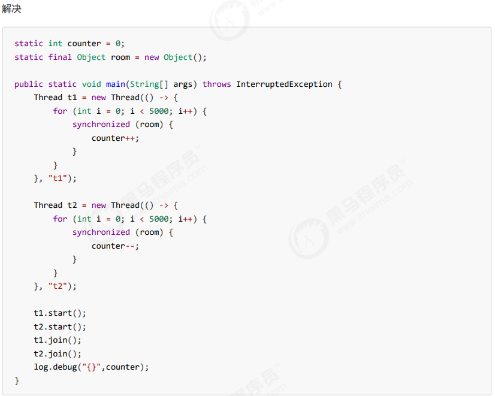

## 共享模型之管程（synchronized）

**竞态条件 Race Condition**：多个线程在临界区内执行，由于代码的执行序列不同而导致结果无法预测，称之为发生了竞态条件

### 一、解决方法

为了避免临界区的竞态条件发生，有多种手段可以达到目的。 

* 阻塞式的解决方案：synchronized，Lock 
* 非阻塞式的解决方案：原子变量

### 二、synchronized 解决方案

**synchronized** 解决方法是阻塞式的，即俗称的【对象锁】，它采用互斥的方式让同一 时刻至多只有一个线程能持有【对象锁】，其它线程再想获取这个【对象锁】时就会阻塞住。这样就能保证拥有锁 的线程可以安全的执行临界区内的代码，**不用担心线程上下文切换**。

**语法：**

```java
synchronized(对象) // 线程1， 线程2(blocked)
{
 临界区
}
```



**思考：**

synchronized 实际是用**对象锁**保证了**临界区内代码的原子性**，临界区内的代码对外是不可分割的，不会被线程切换所打断。

为了加深理解，请思考下面的问题：

* 如果把 synchronized(obj) 放在 for 循环的外面，如何理解？-- 原子性，即这个for循环的代码具有原子性，执行时不会被打断

* 如果 t1 synchronized(obj1) 而 t2 synchronized(obj2) 会怎样运作？-- 锁对象，不同的对象锁，互不影响

* 如果 t1 synchronized(obj) 而 t2 没有加会怎么样？如何理解？-- 锁对象，互不影响

### 三、面向对象改进

把需要保护的共享变量放入一个类

```java
class Room {

  int value = 0;

  public void increment() {
    synchronized (this) {
      value++;
    }
  }

  public void decrement() {
    synchronized (this) {
      value--;
    }
  }

  public int get() {
    synchronized (this) {
      return value;
    }
  }
}

@Slf4j
public class Test1 {

  public static void main(String[] args) throws InterruptedException {
    Room room = new Room();
    Thread t1 = new Thread(
      () -> {
        for (int j = 0; j < 5000; j++) {
          room.increment();
        }
      },
      "t1"
    );
    Thread t2 = new Thread(
      () -> {
        for (int j = 0; j < 5000; j++) {
          room.decrement();
        }
      },
      "t2"
    );
    t1.start();
    t2.start();
    t1.join();
    t2.join();
    log.debug("count: {}", room.get());
  }
}
```

### 四、方法上的 synchronized

```java
class Test {

  public synchronized void test() {}
}
等价于
class Test {

  public void test() {
    synchronized (this) {}
  }
}
```

```java
class Test {

  public static synchronized void test() {}
}
等价于
class Test {

  public static void test() {
    synchronized (Test.class) {}
  }
}
```

**不加 synchronized 的方法**

不加 `synchronzied` 的方法就好比不遵守规则的人，不去老实排队（好比翻窗户进去的）

**所谓的“线程八锁”**

其实就是考察 synchronized 锁住的是哪个对象