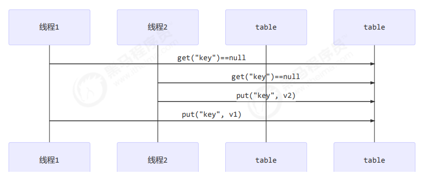

## 共享模型之管程（变量的线程安全分析）

### 一、成员变量和静态变量是否线程安全？

* 如果它们没有共享，则线程安全 
* 如果它们被共享了，根据它们的状态是否能够改变，又分两种情况
  * 如果只有读操作，则线程安全 
  * 如果有读写操作，则这段代码是临界区，需要考虑线程安全

### 二、局部变量是否线程安全？

* 局部变量是线程安全的 

* 但局部变量引用的对象则未必 
  * 如果该对象没有逃离方法的作用访问，它是线程安全的 
  * 如果该对象逃离方法的作用范围，需要考虑线程安全

**局部变量线程安全分析：**

```java
public static void test1() {
	int i = 10;
	i++;
}
```

每个线程调用 test1() 方法时局部变量 `i`，会在每个线程的栈帧内存中被创建多份，因此不存在共享


**局部变量的引用稍有不同：**

例子：

成员变量：

```java
class ThreadUnsafe {

  ArrayList<String> list = new ArrayList<>();

  public void method1(int loopNumber) {
    for (int i = 0; i < loopNumber; i++) {
      // { 临界区, 会产生竞态条件
      method2();
      method3();
      // } 临界区
    }
  }

  private void method2() {
    list.add("1");
  }

  private void method3() {
    list.remove(0);
  }
}
```

执行：

```java
static final int THREAD_NUMBER = 2;
static final int LOOP_NUMBER = 200;

public static void main(String[] args) {
    ThreadUnsafe test = new ThreadUnsafe();
    for (int i = 0; i < THREAD_NUMBER; i++) {
        new Thread(
            () -> {
                test.method1(LOOP_NUMBER);
            },
            "Thread" + i
        ).start();
    }
}
```

其中一种情况是，如果线程2 还未 add，线程1 remove 就会报错：

```java
Exception in thread "Thread1" java.lang.IndexOutOfBoundsException: Index: 0, Size: 0
 at java.util.ArrayList.rangeCheck(ArrayList.java:657)
 at java.util.ArrayList.remove(ArrayList.java:496)
 at cn.itcast.n6.ThreadUnsafe.method3(TestThreadSafe.java:35)
 at cn.itcast.n6.ThreadUnsafe.method1(TestThreadSafe.java:26)
 at cn.itcast.n6.TestThreadSafe.lambda$main$0(TestThreadSafe.java:14)
 at java.lang.Thread.run(Thread.java:748) 
```

分析： 

* 无论哪个线程中的 method2 引用的都是同一个对象中的 list 成员变量 
* method3 与 method2 分析相同

****

**将 list 修改为局部变量：**

```java
class ThreadSafe {
  public final void method1(int loopNumber) {
    ArrayList<String> list = new ArrayList<>();
    for (int i = 0; i < loopNumber; i++) {
      method2(list);
      method3(list);
    }
  }

  private void method2(ArrayList<String> list) {
    list.add("1");
  }

  private void method3(ArrayList<String> list) {
    list.remove(0);
  }
}
```

那么就不会有上述问题了

分析： 

* list 是局部变量，每个线程调用时会创建其不同实例，没有共享 
* 而 method2 的参数是从 method1 中传递过来的，与 method1 中引用同一个对象 
* method3 的参数分析与 method2 相同

**思考：**

方法访问修饰符带来的思考，如果把 method2 和 method3 的方法修改为 public 会不会代理线程安全问题？ 

* 情况1：有其它线程调用 method2 和 method3 
* 情况2：在 情况1 的基础上，为 ThreadSafe 类添加子类，子类覆盖 method2 或 method3 方法，即

```java
class ThreadSafe {
  public final void method1(int loopNumber) {
    ArrayList<String> list = new ArrayList<>();
    for (int i = 0; i < loopNumber; i++) {
      method2(list);
      method3(list);
    }
  }

  private void method2(ArrayList<String> list) {
    list.add("1");
  }

  private void method3(ArrayList<String> list) {
    list.remove(0);
  }
}

class ThreadSafeSubClass extends ThreadSafe {

  @Override
  public void method3(ArrayList<String> list) {
    new Thread(
      () -> {
        list.remove(0);
      }
    ).start();
  }
}
```

> 从这个例子可以看出 private 或 final 提供【安全】的意义所在，请体会开闭原则中的【闭】

### 三、常见线程安全类

- String 
- Integer 
- StringBuffer 
- Random 
- Vector 
- Hashtable 
- java.util.concurrent 包下的类

这里说它们是线程安全的是指，多个线程调用它们同一个实例的某个方法时，是线程安全的。也可以理解为

```java
Hashtable table = new Hashtable();
new Thread(
    () -> {
    table.put("key", "value1");
    }
)
    .start();
new Thread(
    () -> {
    table.put("key", "value2");
    }
).start();
```

- 它们的每个方法是原子的 
- 但注意它们多个方法的组合不是原子的，见后面分析

**线程安全类方法的组合**

分析下面代码是否线程安全？----不是线程安全的

```java
Hashtable table = new Hashtable();
// 线程1，线程2，两个线程同时执行下面的代码
if (table.get("key") == null) {
    table.put("key", value);
}
```



